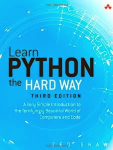
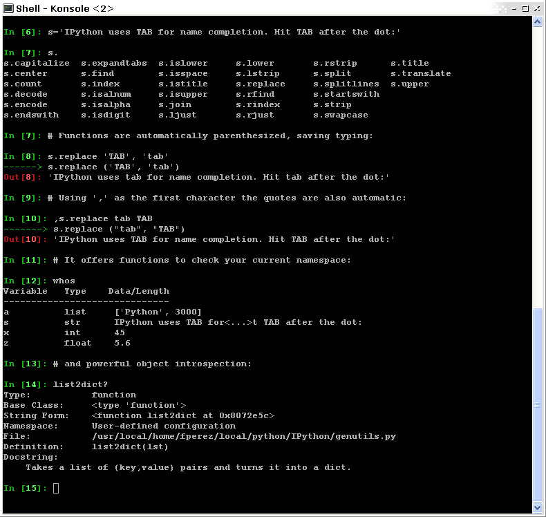
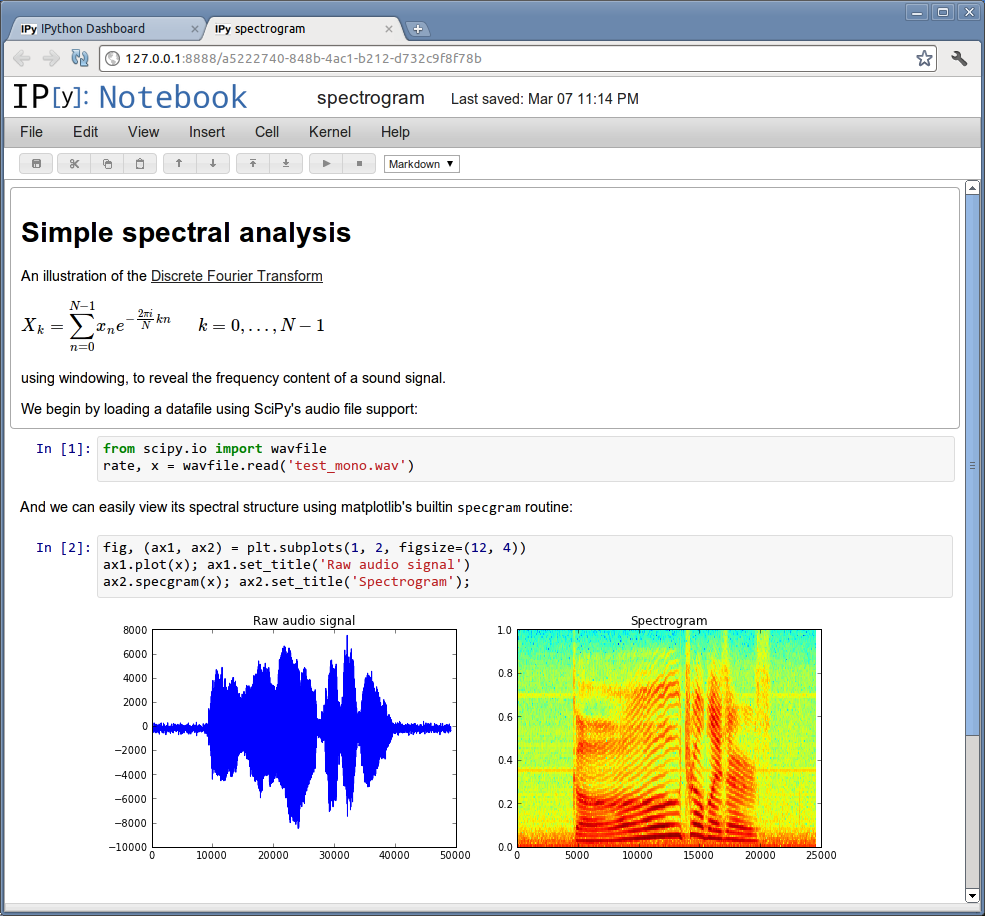
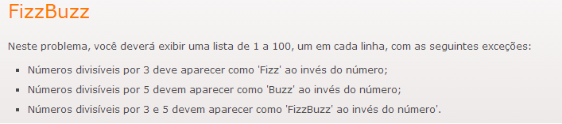

Python é uma linguagem de programação muito utilizada por todo o mundo devido a sua simplicidade e apesar de ser interpretada, apresenta um bom desempenho, sendo utilizada amplamente tanto no meio científico quanto no profissional. Não tem como foco um nicho específico, servindo assim para absolutamente qualquer coisa. Como características podemos citar os fatos de que é uma linguagem de alto nível, funcional e orientada a objetos.

####

  * Leia os tutoriais básicos de python

<table cellpadding="0" style="float:right;margin-left:1em;text-align:right;" cellspacing="0" class="tr-caption-container" ><tbody ><tr >
<td style="text-align:center;" >

</td></tr><tr >
<td style="text-align:center;" class="tr-caption" >Capa do livro Learn Python the Hard Way
</td></tr></tbody></table>

A forma mais tradicional de se aprender algo é lendo sua documentação, então porque teria de ser diferente com uma linguagem de programação? Mais do que ler a [documentação oficial da linguagem](http://docs.python.org/2/tutorial/), pode ser interessante ler outros tutoriais e livros. Um interessante e que ao menos eu vejo funcionar com muita gente é o livro [Learn Python the Hard Way](http://learnpythonthehardway.org/book/), que apesar do nome assustador, é uma ótima referência e não tem nada do que o título diz, sem contar que a versão disponível na web é free.

####

  * Leia a PEP 8

Basicamente a [PEP 8](http://www.python.org/dev/peps/pep-0008/) é um conjunto de regras do que deve-se ou não fazer ao programar em [python](http://www.python.org/). E é claro que muito provavelmente isto não vai fazer com que você aprenda a programar, mas certamente irá lhe ensinar boas prática quando o estiver fazendo. O texto é interessante pelo fato de abordar várias coisas que você já faz sem pensar, como por exemplo ao chamar uma função, qual a melhor forma de passsar seus argumentos? ` f(arg1 = 1, arg2 = 2)`  ou `f(arg1=1, arg2=2)`. Sim, são pequenos detalhes, mas que provavelmente lhe farão falta em um dos momentos que você mais precisar, que é a revisão do código.

####

  * Conheça as estruturas de dados básicas

Certamente esta dica não é única e exclusiva dos usuários de [python](http://www.python.org/). A ideia por trás é estar familiarizado com as estruturas para utilizá-las da melhor forma na hora que estiver resolvendo seus problemas. Algo curioso sobre a linguagem é que [python](http://www.python.org/) não tem uma estrutura de dados que seja um vetor. A função de vetor é feito pela lista, e esta permite uma flexibilidade bem interessante. Entender as particularidades da linguagem é uma condição necessária para utilizá-la. Enquanto estiver lendo a documentação e explorando os diferentes objetos tente responder as seguintes perguntas: Sabe como utilizar um dicionário? Uma tupla? Uma lista? Qual a diferença entre uma lista e uma tupla? Em quais situações é preferível utilizar um dicionário a uma lista?

  * **Explore os diferentes objetos e seus respectivos métodos**

Antes de tudo, gostaria de lembrar uma coisa: O shell python é extremamente cru, não oferecendo feature alguma, portanto recomendaria instalar o mais rápido possível o Ipython, que é um shell python com algumas funcionalidades interessantes como por exemplo autoindentação e introspecção,  e este segundo que é o que interessa aqui. Diferente de muitas linguagens, python está sujeito ao paradigma de programação orientada a objeto, o que significa que existem objetos, e cada um desses objetos possuem seus próprios métodos. Isso dá uma vantagem de aprendizado muito grande, uma vez que você pode explorar estes métodos interativamente no Ipython. Funciona da seguinte forma: Ao criar uma variável x, por exemplo x = 'Hello World', você pode explorá-la ao digitar `x.` o que vai exibir todos os métodos daquele objeto. A figura abaixo é uma screenshot da tela do Ipython e na linha 7 podemos ver o resultado do `x.`.

<table cellpadding="0" align="center" style="font-family:'Times New Roman';letter-spacing:normal;margin-bottom:.5em;margin-left:auto;margin-right:auto;orphans:auto;padding:6px;text-align:center;text-indent:0;text-transform:none;widows:auto;word-spacing:0;" cellspacing="0" class="tr-caption-container" ><tbody ><tr >
<td style="text-align:center;" >

</td></tr><tr >
<td style="font-size:13px;padding-top:4px;text-align:center;" class="tr-caption" >

Screenshot do Ipython.

</td></tr></tbody></table>

####

  * Participe da comunidade

Este é um item geralmente esquecido por boa parte dos usuários, porém na hora do aperto é a primeira fonte a qual recorrer. Não que esteja errado, é claro, porém mais do que apenas absorver conhecimento, é necessário também doar para os mais novos no assunto. Outro ponto positivo sobre a participação dos usuários na comunidade é o fato de que com a interação com outros usuário, você estará atento aos novos desenvolvimentos da linguagem. O principal evento do tipo por aqui é o [PythonBrasil](http://2014.pythonbrasil.org.br/), que este ano irá acontecer entre os dias 7 a 10 de Novembro em Recife/Porto de Galinhas e no momento está com inscrições abertas.

####

  * Entenda um pouco sobre o paradigma de programação orientação a objetos

Python é uma linguagem que comumente é utilizada sob este paradigma, então algumas coisas podem parecer um tanto confusas no começo, como por exemplo o significado de um [objeto](http://pt.wikipedia.org/wiki/Objeto_(inform%C3%A1tica)), [classe](http://pt.wikipedia.org/wiki/Classe_(programa%C3%A7%C3%A3o)), [herança](http://pt.wikipedia.org/wiki/Heran%C3%A7a_(programa%C3%A7%C3%A3o)) e [métodos](http://pt.wikipedia.org/wiki/M%C3%A9todo_(programa%C3%A7%C3%A3o)). Um exemplo prático de como estas coisas poderão ser percebidas é ao utilizar o método `update` de um dicionário, que faz com que o dicionário seja alterado sem fazer nenhum tipo de atribuição. Ao entender um pouco como estas coisas funcionam, a lógica de programação irá fluir de forma mais suave e natural.

####

  * Utilize uma IDE amigável

É muito comum os marinheiros de primeira viagem se perderem em meio a tantas opções de IDE, e caso opte por não utilizar uma IDE se perder no próprio terminal, afinal quem nunca teve a síndrome da tela preta? Portanto utilizar uma IDE amigável pode ajudar a sentir-se mais confortável com este novo mundo. Uma IDE que eu acredito que funcione bem com iniciantes é o [Ipython notebook](http://ipython.org/) que é uma extensão do [Ipython](http://ipython.org/). A interface é simples e amigável, além de permitir uma série de coisas, como inserção de texto, equações e executar os códigos em pequenos chunks, o que fornece um potencial didático incrível.

<table cellpadding="0" align="center" style="margin-left:auto;margin-right:auto;text-align:center;" cellspacing="0" class="tr-caption-container" ><tbody ><tr >
<td style="text-align:center;" >

</td></tr><tr >
<td style="text-align:center;" class="tr-caption" >Interface do Ipython Notebook

</td></tr></tbody></table>

####

  * Treine com aplicação a problemas práticos

Focar o direcionamento do aprendizado em problemas prático pode ser uma boa estratégia, uma vez que você deve desdobrar-se de qualquer jeito para atingir aquele objetivo. A galera do Coding Dojo mantém um [site com alguns problemas interessantes](http://dojopuzzles.com/problemas/) e que aparecem de forma aleatória.

<table cellpadding="0" align="center" style="margin-left:auto;margin-right:auto;text-align:center;" cellspacing="0" class="tr-caption-container" ><tbody ><tr >
<td style="text-align:center;" >

</td></tr><tr >
<td style="text-align:center;" class="tr-caption" >Que tal começar com o clássico FizzBuzz?
</td></tr></tbody></table>
