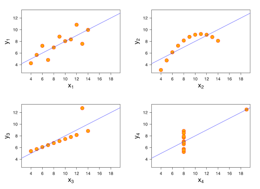

Vivemos um momento em que nunca produzimos tanta informação. Há quem afirme que nos últimos dois anos produziu-se mais informação do que em toda a história da humanidade. Para ter noção da dimensão da coisa não é necessária uma situação complexa, basta parar e pensar na quantidade de dados gerados por você mesmo a cada dia. Vamos tentar: Acordo às 7:00h, 8:15h eu saio de casa, compro o jornal, pego um ônibus e pago com o Rio Card - provavelmente isto registra o horário que peguei o ônibus e quantas vezes faço com aquela linha - ,  acesso meus e-mails, rede social e se for quinta-feira pode ser que eu vá ao cinema. Praticamente tudo que fazemos pode virar uma informação no final, e esta pode ser consumida e utilizada - contra ou favor de você .

E é claro, que deve-se lembrar também que visualizar dados não é uma tarefa nova, existem relatos de que as visualizações mais populares - gráficos de barras e linhas - que temos foram originadas no século XVIII. Então por qual motivo deveríamos conhecer mais sobre visualização de dados? O motivo é simples, já que o nosso apetite para consumir estes dados nunca foi maior então é razoável pensar que precisamos ser mais efetivos e eficientes na forma como estes dados são comunicados.

Através da visualização podemos descrever os dados de uma forma que nos permita ver aqueles dados de um outro ponto de vista, observar padrões, exceções e possíveis histórias ocultas, ali nos dados originais e sequer sabermos disso.

Uma importante contribuição para o campo da visualização da informação foi feita por [Francis Anscombe](http://en.wikipedia.org/wiki/Frank_Anscombe) (que pasmem, era cunhado do [Tukey](http://en.wikipedia.org/wiki/John_Tukey)) em 1970. O que Anscombe fez foi apresentar o que foi chamado de o [Quarteto de Anscombe](http://en.wikipedia.org/wiki/Anscombe%27s_quartet), que eram 4 conjuntos de dados com propriedades estatísticas exatamente iguais.

<table style="margin-left:auto;margin-right:auto;text-align:center;" >Quarteto de Anscombe<tbody ><tr >IIIIIIIV</tr><tr >
<td >x
</td>
<td >y
</td>
<td >x
</td>
<td >y
</td>
<td >x
</td>
<td >y
</td>
<td >x
</td>
<td >y
</td></tr><tr >
<td >10.0
</td>
<td >8.04
</td>
<td >10.0
</td>
<td >9.14
</td>
<td >10.0
</td>
<td >7.46
</td>
<td >8.0
</td>
<td >6.58
</td></tr><tr >
<td >8.0
</td>
<td >6.95
</td>
<td >8.0
</td>
<td >8.14
</td>
<td >8.0
</td>
<td >6.77
</td>
<td >8.0
</td>
<td >5.76
</td></tr><tr >
<td >13.0
</td>
<td >7.58
</td>
<td >13.0
</td>
<td >8.74
</td>
<td >13.0
</td>
<td >12.74
</td>
<td >8.0
</td>
<td >7.71
</td></tr><tr >
<td >9.0
</td>
<td >8.81
</td>
<td >9.0
</td>
<td >8.77
</td>
<td >9.0
</td>
<td >7.11
</td>
<td >8.0
</td>
<td >8.84
</td></tr><tr >
<td >11.0
</td>
<td >8.33
</td>
<td >11.0
</td>
<td >9.26
</td>
<td >11.0
</td>
<td >7.81
</td>
<td >8.0
</td>
<td >8.47
</td></tr><tr >
<td >14.0
</td>
<td >9.96
</td>
<td >14.0
</td>
<td >8.10
</td>
<td >14.0
</td>
<td >8.84
</td>
<td >8.0
</td>
<td >7.04
</td></tr><tr >
<td >6.0
</td>
<td >7.24
</td>
<td >6.0
</td>
<td >6.13
</td>
<td >6.0
</td>
<td >6.08
</td>
<td >8.0
</td>
<td >5.25
</td></tr><tr >
<td >4.0
</td>
<td >4.26
</td>
<td >4.0
</td>
<td >3.10
</td>
<td >4.0
</td>
<td >5.39
</td>
<td >19.0
</td>
<td >12.50
</td></tr><tr >
<td >12.0
</td>
<td >10.84
</td>
<td >12.0
</td>
<td >9.13
</td>
<td >12.0
</td>
<td >8.15
</td>
<td >8.0
</td>
<td >5.56
</td></tr><tr >
<td >7.0
</td>
<td >4.82
</td>
<td >7.0
</td>
<td >7.26
</td>
<td >7.0
</td>
<td >6.42
</td>
<td >8.0
</td>
<td >7.91
</td></tr><tr >
<td >5.0
</td>
<td >5.68
</td>
<td >5.0
</td>
<td >4.74
</td>
<td >5.0
</td>
<td >5.73
</td>
<td >8.0
</td>
<td >6.89
</td></tr></tbody></table>

Algumas informações interessantes:

  * Em todos os grupos, a média da variável **x** é 9.
  * Em todos os grupos, a variância da variável **x** é 11.
  * Em todos os grupos, a média da variável **y** é 7.5 .
  * A variância da variável **y** é 4.122 ou 4.127.
  * Em todos os grupos a correlação entre **x** e **y** é 0.816 .
  * Em todos os casos a equação da regressão linear simples é   **y** = 3.00 + 0.500 **x**.

E então vem a pergunta de 1 milhão de dólares: Vendo estas estatísticas descritivas, o que você pode afirmar sobre a relação de **x** com **y** em cada um dos casos? Bom, acredito que não tenha muita coisa. Porém ao vermos o gráfico das relações entre **x** e **y** em cada um dos grupos a tarefa torna-se relativamente mais fácil.

<table cellpadding="0" align="center" style="margin-left:auto;margin-right:auto;text-align:center;" cellspacing="0" class="tr-caption-container" ><tbody ><tr >
<td style="text-align:center;" >

</td></tr><tr >
<td style="text-align:center;" class="tr-caption" >Fonte: Wikipedia
</td></tr></tbody></table>

Com o gráfico é quase trivial perceber a real relação entre **x** e **y** em cada um dos grupos, que antes era 'mascarada' pelas medidas descritivas. O primeiro grupo tem uma relação linear bem comportada, o segundo quadrática, o terceiro linear perfeita com a presença de um outlier e o quarto uma relação linear meio esquisita. E a genialidade de [Anscombe](http://en.wikipedia.org/wiki/Frank_Anscombe) neste exemplo dispensa comentários, pois visualmente conseguimos ver as relações entre **x** e **y** de forma natural - para não dizer automática - e sem nenhuma dificuldade, afinal é muito mais fácil descobrir e confirmar a presença de padrões, relações e características através da exibição visual.

No começo do século XX a [Escola de Psicologia de Gestalt](http://en.wikipedia.org/wiki/Gestalt_psychology) fez uma série de estudos sobre percepção visual com o objetivo de entender como o cérebro e os olhos funcionam conjuntamente ao processar informações como sinais visuais. Com isso chegaram a conclusão de que nossas funções visuais são extremamente rápidas e eficientes, diferente de nosso processo cognitivo, significativamente mais lento e menos eficiente.

E isto faz com que visualização da informação seja um misto de arte e ciência. Excitante, desafiador e prazeroso, eu diria.
