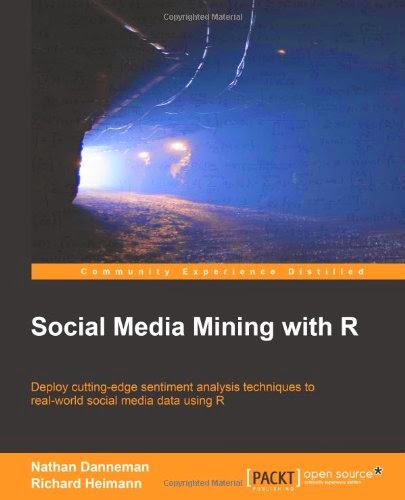

### Introdução

Mídias sociais são o verdadeiro assunto do momento. Se antes a informação era centralizada por veículos de comunicação, hoje a coisa é um pouco diferente, seja por desconfiança da população nos veículos mais tradicionais ou pela velocidade com que as coisas acontecem e são passadas aos leitores. Logo percebeu-se a complexidade e riqueza das informações geradas pelas mídias sociais - livre, independente e rápida - e a real necessidade de utilizar métodos computacionais e estatísticos para analisar tais informações. Mas é claro que realizar tal atividade não é trivial, uma vez que a informação tende a ser não estruturada e com bastante ruído. Neste contexto, o livro é apresentado, focando especialmente na ideia de minerar opiniões de mídias sociais com a utilização das seguintes metodologias: Polarização com base em dicionários, classificador de Naive Bayes e por último Teoria de Resposta ao Item aplicado a análise de sentimentos.

### Pontos Positivos

**Fácil leitura**

O assunto sobre mídias sociais é apresentado lentamente e de uma forma bem agradável. Seja para quem desconhece totalmente o assunto ou para quem não tem experiência com o R - existe um capítulo introdutório que apresenta tudo que é necessário ao desenrolar do livro.

**Boa contextualização**

Em todo momento, os autores Nathan Danneman e Richard Heimann se preocupam com a contextualização do problema ao tentar alertar ao leitor dos pontos positivos e negativos sobre o conteúdo disponível em mídias sociais, assim como as dificuldades associadas a cada uma das metodologias apresentadas.

**Estudos de casos**

O livro conta com um capítulo dedicado exclusivamente a aplicar cada uma das metodologias apresentadas, e é claro que a modelagem é apenas um detalhe. Assim podemos acompanhar todo o raciocínio de analisar um conjunto de dados não estruturado, começando pelas dificuldades envolvidas já no pré-processamento até a modelagem e sua validação. A discussão em torno dos modelos é interessante e gera uma ansiedade sobre qual será o próximo passo a ser tomado.

**
**

### Pontos Negativos

**Curto demais**

No total o livro conta com apenas 122 páginas, o que é pouca coisa, dado a complexidade do tema proposto. Só para lembrar, no livro são abordados os temas de mídias sociais, metodologias que podem ser aplicadas a mineração de opiniões e  o uso do software R.

**Pouco apelo matemático**

Geralmente o problema é o contrário, devido a quantidade de equações e definições, perde-se o entendimento sobre a essência do livro, mas aqui este foi um fato bem incômodo. Em todo o livro, uma única equação é apresentada, o que dá a entender que a metodologia já deveria ser de domínio do leitor.

### Conclusão

Para os iniciantes o livro mostra-se uma boa opção introdutória. Todo o contexto, impacto e possibilidades existentes nas mídias sociais são apresentados. As metodologias são exploradas a passos curtos e as conclusões surgem de forma natural ao caminhar do livro. Porém o livro peca um pouco na baixa formalização matemática, apesar de avaliar qualitativamente muito bem os modelos. Para quem possui interesse no assunto, é um bom investimento inicial.
