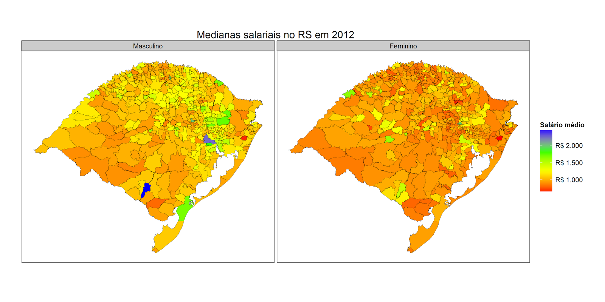
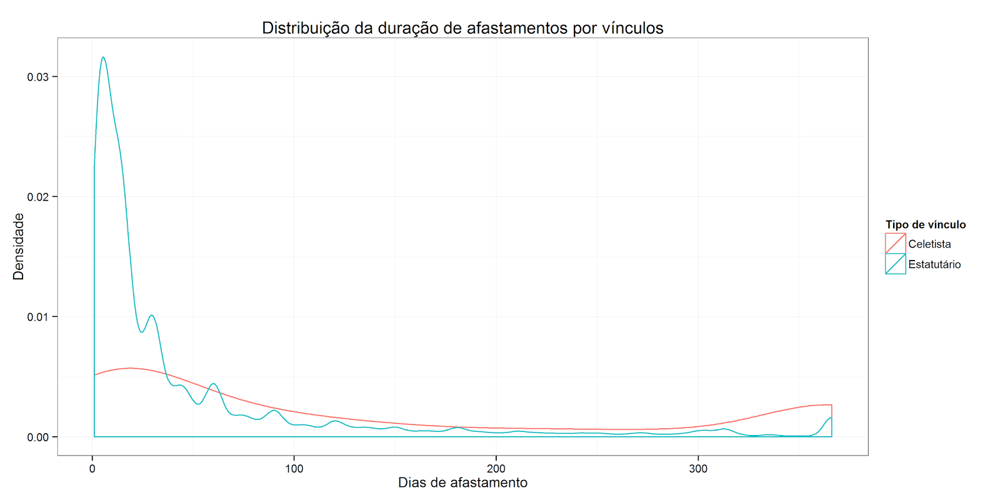

Dando início à minha série de postagens aqui no Dados Aleatórios, irei falar sobre os microdados da RAIS - Relação Anual de Informações Sociais - disponibilizados pelo Ministério do Trabalho e Emprego. A RAIS é, como o nome já diz, uma relação de informações que todo empregador é obrigado a informar anualmente sobre os seus trabalhadores do ano base (ou seja, inclui quem foi demitido). Essas informações vão desde informações trabalhistas (tempo de serviço, salário recebido, motivos de licenças/demissão, entre outras) até informações pessoais (idade, escolaridade, raça/cor).

Os dados podem ser baixados nesse link do [Drive](https://drive.google.com/folderview?id=0ByKsqUnItyBhU2RmdUloTnJGRGM&usp=sharing) ou do [Skydrive](https://onedrive.live.com/?cid=4730a18374157534&id=4730A18374157534%21107&authkey=!AGle_BhixMoXOwM) a partir do ano de 2007 por estado (maiores informações a respeito dos dados podem ser encontradas no site do [MTE](http://portal.mte.gov.br/geral/estatisticas.htm)). Apesar de estarem salvos como .TXT, eles na realidade são arquivos .CSV e podem ser lidos usando os códigos [desta postagem do meu antigo blog](http://rcoster.blogspot.com.br/2014/02/lendo-grandes-bancos-de-dados.html#more).

As possibilidades de análises são inúmeras. Por exemplo, é possível comparar a mediana salarial por raça e grau de escolaridade.

<table style="text-align:center;" border="1" ><tbody ><tr >INDIGENABRANCAPRETAAMARELAPARDA</tr><tr >
<td style="text-align:right;" >ANALFABETO
</td>
<td style="text-align:right;" >992,94
</td>
<td style="text-align:right;" >881,99
</td>
<td style="text-align:right;" >859,24
</td>
<td style="text-align:right;" >1.101,97
</td>
<td style="text-align:right;" >880,79
</td></tr><tr >
<td style="text-align:right;" >ATE 5.A INC
</td>
<td style="text-align:right;" >954,90
</td>
<td style="text-align:right;" >986,65
</td>
<td style="text-align:right;" >913,98
</td>
<td style="text-align:right;" >917,06
</td>
<td style="text-align:right;" >965,60
</td></tr><tr >
<td style="text-align:right;" >5.A CO FUND
</td>
<td style="text-align:right;" >1.002,02
</td>
<td style="text-align:right;" >1.024,24
</td>
<td style="text-align:right;" >949,35
</td>
<td style="text-align:right;" >969,43
</td>
<td style="text-align:right;" >1.015,07
</td></tr><tr >
<td style="text-align:right;" >6. A 9. FUND
</td>
<td style="text-align:right;" >1.012,43
</td>
<td style="text-align:right;" >1.013,99
</td>
<td style="text-align:right;" >926,00
</td>
<td style="text-align:right;" >946,49
</td>
<td style="text-align:right;" >955,33
</td></tr><tr >
<td style="text-align:right;" >FUND COMPL
</td>
<td style="text-align:right;" >1.022,92
</td>
<td style="text-align:right;" >1.038,05
</td>
<td style="text-align:right;" >943,18
</td>
<td style="text-align:right;" >1.034,25
</td>
<td style="text-align:right;" >1.013,15
</td></tr><tr >
<td style="text-align:right;" >MEDIO INCOMP
</td>
<td style="text-align:right;" >975,32
</td>
<td style="text-align:right;" >939,29
</td>
<td style="text-align:right;" >888,51
</td>
<td style="text-align:right;" >923,45
</td>
<td style="text-align:right;" >906,54
</td></tr><tr >
<td style="text-align:right;" >MEDIO COMPL
</td>
<td style="text-align:right;" >1.113,28
</td>
<td style="text-align:right;" >1.099,33
</td>
<td style="text-align:right;" >1.040,89
</td>
<td style="text-align:right;" >1.018,55
</td>
<td style="text-align:right;" >1.101,37
</td></tr><tr >
<td style="text-align:right;" >SUP. INCOMP
</td>
<td style="text-align:right;" >1.406,09
</td>
<td style="text-align:right;" >1.485,39
</td>
<td style="text-align:right;" >1.329,05
</td>
<td style="text-align:right;" >1.393,45
</td>
<td style="text-align:right;" >1.433,89
</td></tr><tr >
<td style="text-align:right;" >SUP. COMP
</td>
<td style="text-align:right;" >2.323,27
</td>
<td style="text-align:right;" >2.690,94
</td>
<td style="text-align:right;" >1.983,70
</td>
<td style="text-align:right;" >3.018,74
</td>
<td style="text-align:right;" >2.487,59
</td></tr><tr >
<td style="text-align:right;" >MESTRADO
</td>
<td style="text-align:right;" >3.244,96
</td>
<td style="text-align:right;" >4.034,55
</td>
<td style="text-align:right;" >2.782,44
</td>
<td style="text-align:right;" >3.778,04
</td>
<td style="text-align:right;" >3.204,21
</td></tr><tr >
<td style="text-align:right;" >DOUTORADO
</td>
<td style="text-align:right;" >1.720,08
</td>
<td style="text-align:right;" >9.213,15
</td>
<td style="text-align:right;" >4.135,44
</td>
<td style="text-align:right;" >12.651,55
</td>
<td style="text-align:right;" >5.499,99
</td></tr></tbody></table>

Outro exemplo interessante é a comparação da mediana salarial por sexo e grau de escolaridade.

<table border="1" ><tbody ><tr >MasculinoFeminino</tr><tr >
<td align="right" >ANALFABETO
</td>
<td align="right" >926,16
</td>
<td align="right" >765,36
</td></tr><tr >
<td align="right" >ATE 5.A INC
</td>
<td align="right" >1.084,91
</td>
<td align="right" >850,04
</td></tr><tr >
<td align="right" >5.A CO FUND
</td>
<td align="right" >1.146,35
</td>
<td align="right" >874,40
</td></tr><tr >
<td align="right" >6. A 9. FUND
</td>
<td align="right" >1.142,91
</td>
<td align="right" >858,43
</td></tr><tr >
<td align="right" >FUND COMPL
</td>
<td align="right" >1.188,81
</td>
<td align="right" >864,44
</td></tr><tr >
<td align="right" >MEDIO INCOMP
</td>
<td align="right" >1.070,65
</td>
<td align="right" >830,48
</td></tr><tr >
<td align="right" >MEDIO COMPL
</td>
<td align="right" >1.287,06
</td>
<td align="right" >967,02
</td></tr><tr >
<td align="right" >SUP. INCOMP
</td>
<td align="right" >1.854,66
</td>
<td align="right" >1.310,38
</td></tr><tr >
<td align="right" >SUP. COMP
</td>
<td align="right" >3.778,28
</td>
<td align="right" >2.050,77
</td></tr><tr >
<td align="right" >MESTRADO
</td>
<td align="right" >4.655,48
</td>
<td align="right" >3.587,15
</td></tr><tr >
<td align="right" >DOUTORADO
</td>
<td align="right" >8.614,78
</td>
<td align="right" >7.627,01
</td></tr></tbody></table>É possível ainda criar mapas com os dados utilizando as [malhas digitais fornecidas pelo IBGE](ftp://geoftp.ibge.gov.br/malhas_digitais/censo_2010/setores_censitarios/). Os únicos cuidados que devem ser tomados é com qual variável de localidade é a de interesse (o município onde a empresa é registrada ou o município onde o trabalhador trabalha) e remover o último dígito dos código de município da malha do IBGE, pois o MTE não utiliza o digito verificador. Um exemplo de mapa é a mediana salarial por município e por sexo.<table cellpadding="0" align="center" style="margin-left:auto;margin-right:auto;text-align:center;" cellspacing="0" class="tr-caption-container" ><tbody ><tr >
<td >
</td></tr><tr >
<td style="font-size:13.333333969116px;" class="tr-caption" >Pessoal de Candiota ta ganhando bem!
</td></tr></tbody></table>

Uma outra analise que fiz foi a comparação do tempo de licença por doença ou acidente de trabalho entre professores da rede pública e professores da rede privada. Em 2012 o RS possuia 20.992 vínculos celetistas e 151.495 vínculos estatutários (note que uma mesma pessoa pode contar mais de uma vez e nas duas categorias). Dos celetistas, 4,19% (880) tiveram algum tipo de afastamento, enquanto nos estatutários esse percentual sobe para 12,84% (19.459). Já quando analisamos a mediana do tempo de afastamento, os estatutários apresentam valor inferior (15 dias) quando comparado com os celetistas (60 dias). Parte desse resultado pode ser explicado pelo grande número de licenças pequenas (menores que 5 dias) tiradas pelos professores estatutários. Geralmente, faltas pequenas podem ser abonadas pela chefia imediata nos setores públicos, mesmo sem a apresentação de atestados. Abaixo é possível ver a distribuição da duração dos afastamento por tipo de vínculo.

Claro que as análises aqui foram superficiais, apenas para exemplificar possíveis análises com o banco. Um co-variável importante e que não foi utilizada no estudo do afastamento é a idade dos funcionário, que difere nos 2 tipos de vínculo (A idade média dos estatutários é 4,5 anos maior que dos celetistas). Como sempre, os códigos utilizados aqui estão disponíveis no meu [Drive](http://goo.gl/gK3l2k). Dúvidas, críticas e sugestões são bem vindas!
