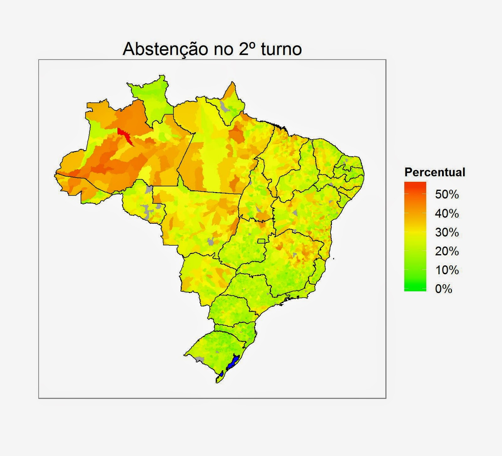
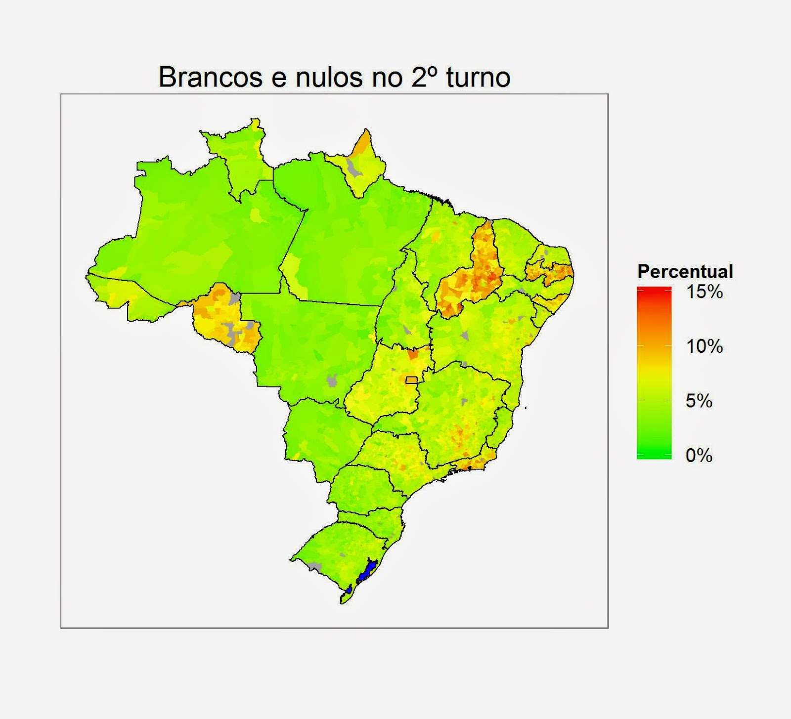
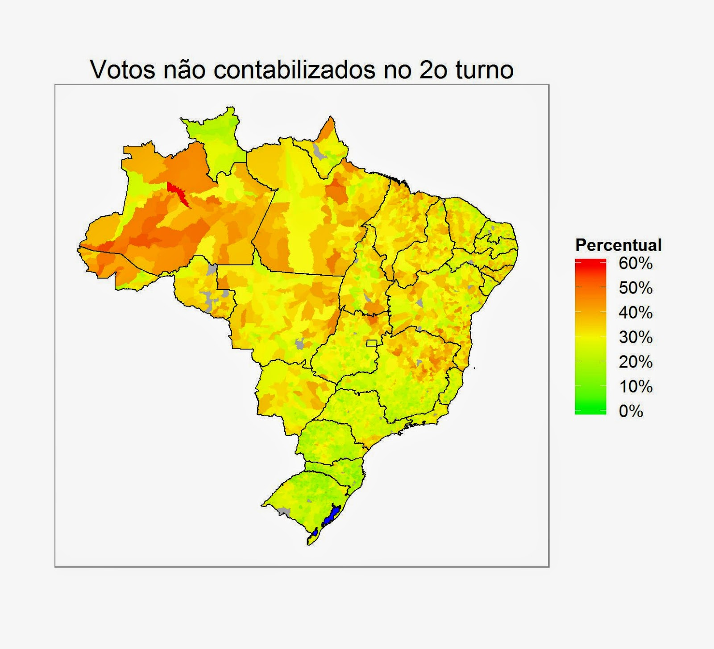

Todo ano eleitoral é a mesma coisa: partidos/candidatos tentando convencer que são melhores que os adversários, seja mostrando seus projetos/feitos ou criticando os dos adversários. E as pessoas mais politizadas repassando para todos a informação, tentando angariar mais votos para o seu candidato. Mas como será que é a taxa de participação dos brasileiros nas eleições?

Para responder a pergunta, usarei os dados do [Repositório de dados eleitorais](http://www.tse.jus.br/eleicoes/estatisticas/repositorio-de-dados-eleitorais) do TSE. Neste repositório podemos encontrar 10 bancos de dados com informações de eleitorado, candidatos, resultados e prestação de conta dos candidatos. Também utilizarei as tabelas já prontas das [Estatísticas Eleitorais](http://www.tse.jus.br/eleicoes/estatisticas), uma vez que nem todos os dados da eleição presidencial de 2010 estão disponíveis.

Em 2010, o Brasil possuía um total de 135.804.084 pessoas aptas a votarem. Dessas, 24.610.296 (18,12%) não compareceram as urnas no primeiro turno e 29.082.700 (21,42%)  não compareceram no segundo turno. Caso essas pessoas comparecessem na eleição e votassem nos candidatos (ou seja, não votassem branco nem nulo), a eleição poderia ter sido resolvida no 1º turno, ou o resultado do 2º turno poderia ter sido diferente (a diferença entre os 2 candidatos foi de pouco mais de 12 milhões de votos). Abaixo podemos ver a abstenção de cada município brasileiro.

Podemos observar uma taxa de abstenção maior no estado do Amazonas e Acre e em algumas regiões do Pará e Mato Grosso. No primeiro turno, regiões de Minas Gerais, Bahia e Espirito Santo também apresentam taxas levemente superiores quando comparadas com o restante do país ([link](https://drive.google.com/file/d/0B_OX1FlzVrSxX2RWTDdxUFNFSVU/edit?usp=sharing)). Mas nem todo voto vai para um candidato/partido: ainda restam os votos em branco e nulos. Votos em branco e nulos são votos que são desconsiderados na hora da apuração do resultado eleitoral e servem - [citando o próprio TSE](http://www.tse.jus.br/institucional/escola-judiciaria-eleitoral/revistas-da-eje/artigos/revista-eletronica-eje-n.-4-ano-3/voto-nulo-e-novas-eleicoes) - "quando muito, para fins de estatística". Ou seja: votar em nulo ou em branco é equivalente a não ir votar, a única diferença é que não paga multa.

No primeiro turno das eleições de 2010, 9.603.594 (8,64%) dos votos foram em branco ou nulos, número que reduziu para 7.142.025 (6,70%) no segundo turno. No mapa abaixo podemos ver a taxa de votos nulos e em branco por município brasileiro, onde é possível observar uma taxa elevada nos estados de Rondônia, Piauí e Paraíba. No primeiro turno, observamos uma taxa mais elevada em toda região nordeste ([link](https://drive.google.com/file/d/0B_OX1FlzVrSxc1QtVWN6TmI0SXM/edit?usp=sharing)).

Somando os votos brancos e nulos com a quantidade de pessoas que não foram votar, concluímos que 36.224.725 (26,67%) pessoas simplesmente não participaram do processo de escolha do novo presidente. Esse número é pouco maior que a quantidade de votos do segundo colocado no primeiro turmo. Por fim, deixo um mapa que mostra o percentual de votos não contabilizados (em brancos, nulo e abstenções) em relação ao total de pessoas aptas a votar.

Como de costume, os códigos utilizados estão no meu [Drive](http://goo.gl/gK3l2k), junto com os mapas em escala maior para os dois turnos.
