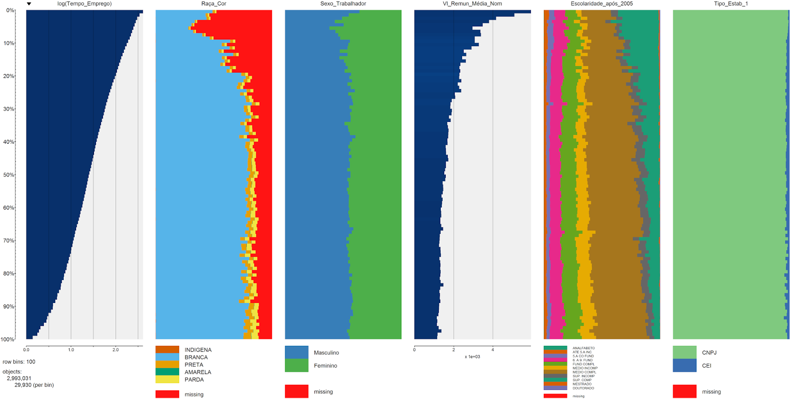
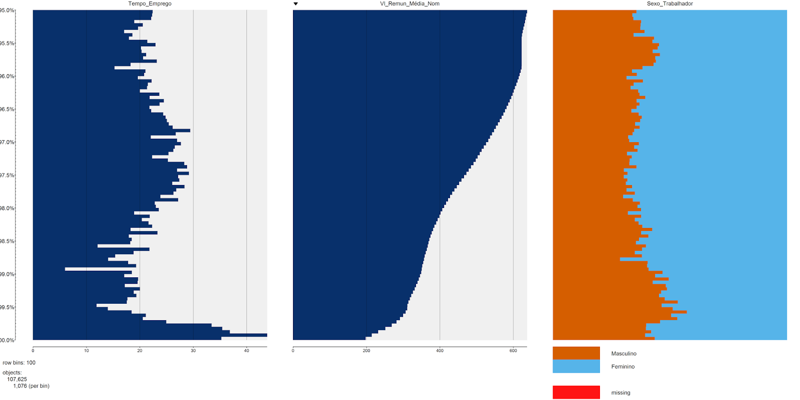

Já comentamos aqui no blog [a importância da visualização dos dados](http://www.dadosaleatorios.com.br/2014/04/como-a-visualizacao-de-dados-pode-nos-ajudar.html) antes de se fazer qualquer análise. Entretanto, nem sempre essa visualização é trivial, seja pelo grande número de variáveis ou pelo grande número de observações. Ao dar plot() em um data.frame com n variáveis, o R gera n² gráficos de dispersão de todas combinações das variáveis. Apesar de ser prático e funcional para variáveis contínuas, ele fica devendo uma maneira funcional de visualizar as variáveis categóricas. O pacote [tabplot](http://cran.r-project.org/web/packages/tabplot/index.html) veio para resolver esse problema

Os gráficos montados pelo tabplot são bastante bonitos e funcionais. Por exemplo, num data.frame com as variáveis Tempo_Emprego, Raça_Cor, Sexo_Trabalhador, Vl_Remun_Média_Nom, Escolaridade_após_2005, Tipo_Estab_1 da RAIS 2012 (e nessa ordem), um simples tableplot(dados) resulta no seguinte gráfico:

Para montar o gráfico, o pacote ordena os dados conforme a ordem das variáveis no data.frame (é possível alterar através do parâmetro sortCol) e depois separa em 100 partes menores (parâmetro nBins). Após organizar e separar em bancos menores, o gráfico é montado na seguinte maneira: para as variáveis numéricas, é representado o valor médio de cada parte do banco e, para as categóricas, é representado o percentual que cada categoria representa. A forma como os missings (NA) são tratados também varia para cada tipo de variável: enquanto nas variáveis categóricas eles são representados na cor vermelha (parâmetro colorNA), nas variáveis numéricas é representado através da transparência da barra: quanto maior o percentual de missings, mais transparente é a barra. Caso todos valores forem missings, é plotado uma barra rosa clara.

O comando permite personalizar praticamente tudo do gráfico, como a escala das variáveis numéricas (logarítmica e linear) e as cores utilizadas. Uma função interessante é a de dar zoom em um determinado intervalo, através dos parâmetros from e to. Também é possível selecionar só algumas variáveis do data.frame, assim como somente alguns casos (que respeitam algum critério ou uma amostra aleatória). Caso seja grande a quantidade de variáveis, o comando retorna mais de um gráfico, todos contendo a variável referência.

<table cellpadding="0" align="center" style="margin-left:auto;margin-right:auto;text-align:center;" cellspacing="0" class="tr-caption-container" ><tbody ><tr >
<td style="text-align:center;" >

</td></tr><tr >
<td style="text-align:center;" class="tr-caption" >tableplot(dados, select = c(Tempo_Emprego, Vl_Remun_Média_Nom, Sexo_Trabalhador), from = 95, to = 100, sortCol = 2, title = 'RAIS 2012 - RS', subset = Raça_Cor == 'BRANCA')
</td></tr></tbody></table>

O pacote ainda apresenta alguns bugs, como não salvar gráficos com títulos - apesar de mostrar no R o título - e não trabalhar com variáveis do tipo character (nem transforma-las automaticamente em fator), mas já se mostra extremamente útil e promissor. Mais detalhes sobre o pacote podem ser encontrados [aqui](http://cran.r-project.org/web/packages/tabplot/vignettes/tabplot-vignette.html). Como de praxe, os comandos utilizados para esse postagem se encontram no meu [Drive](http://goo.gl/gK3l2k). Dúvidas, críticas e sugestões (essa postagem veio da sugestão de um dos nossos leitores!), é só comentar!
