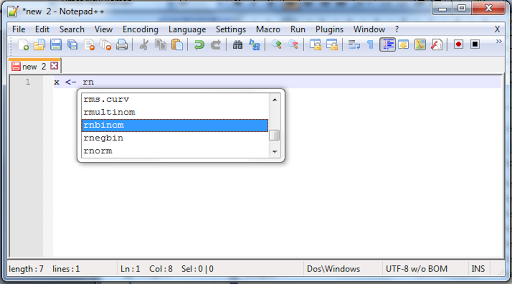
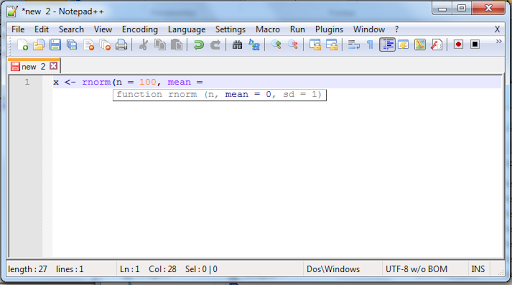

Dentre os vários editores de código existentes ([aqui](http://www.hongkiat.com/blog/free-code-editors-reviewed/) tem uma lista com 10), o que escolhi utilizar foi o [Notepad++](http://notepad-plus-plus.org/). Antes dele, utilizava o tradicional bloco de notas do Windows e fui bastante resistente em abandonar ele, trocando apenas quando meus códigos começaram a ficar grandes. Com o tempo fui descobrindo as funcionalidades dele, como a indentação em bloco, a identificação dos pares de {} e () - o que me fez abandonar o bloco de notas - e a busca e substituição por expressões regulares. O Notepad++ também colore o código de acordo com a linguagem informada, reconhecendo as principais funções do R. Mas ainda faltava algo: uma lista com as funções e parâmetros do R. Faltava, pois não falta mais.

Pesquisando no Google, encontrei [essa postagem](http://yihui.name/en/2010/08/auto-completion-in-notepad-for-r-script/) em um blog, que leva para esse código no [GitHub](https://gist.github.com/yihui/2143971) (já falamos sobre ele [aqui no blog](http://www.dadosaleatorios.com.br/2014/05/usando-o-github-para-hospedar-codigos-r.html)). Basicamente, o código cria um XML com os comandos dos pacotes instalados que são indicados como "Recomendados" ou fazem são instalados junto com o R (installed.packages()[, 'Priority']) e os carregados anteriormente. Esse XML será salvo no diretório de trabalho (getwd()) e deve ser movido para a pasta \plugins\APIs na pasta criada pelo instalador do Notepad++. Após, ao selecionar a linguagem como R (ou abrir um arquivo com a extenção .R), ele listará as funções conforme você digita.

<table cellpadding="0" align="center" style="margin-left:auto;margin-right:auto;text-align:center;" cellspacing="0" class="tr-caption-container" ><tbody ><tr >
<td style="text-align:center;" >

</td></tr><tr >
<td style="text-align:center;" class="tr-caption" >Lista de funções que começam com rn
</td></tr></tbody></table>
Após terminar de escrever a função, ele listará os parâmetros e seus valores padrões.

<table cellpadding="0" align="center" style="margin-left:auto;margin-right:auto;text-align:center;" cellspacing="0" class="tr-caption-container" ><tbody ><tr >
<td style="text-align:center;" >

</td></tr><tr >
<td style="text-align:center;" class="tr-caption" >Parâmetros da função rnorm()
</td></tr></tbody></table>
