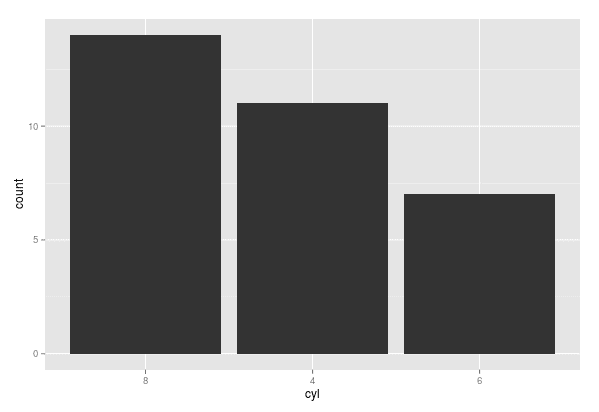

Anteriormente já abordamos dois posts sobre o [ggplot](http://ggplot2.org/): o primeiro deles falava sobre a [personalização das escalas dos eixos](http://www.dadosaleatorios.com.br/2014/10/alterando-escala-dos-eixos-no-ggplot2.html) e outro sobre como fazer [gráficos múltiplos](http://www.dadosaleatorios.com.br/2014/10/fazendo-multiplos-graficos-com-o-ggplot2.html) no ggplot. Hoje vamos continuar abordando o tema e o post será sobre a ordenação do gráfico de barras. Naturalmente a ordem das barras é controlada através de fatores, que são uma estrutura de dados utilizada para representar categorias - que é diferente do caractere.

Sobre a ordenação das barras existem algumas boas práticas a serem seguidas. As barras devem ser ordenadas de ordem alfabética, por valor ou seguindo alguma sequência, de forma a manter algum significado e não deixar o leitor perdido. Mas como devemos fazer para ordenar as barras de forma crescente? O exemplo a seguir faz um gráfico de barras ordenado para a variável cyl, do conjunto de dados mtcars.

    library(ggplot2)  mtcars$cyl = factor(mtcars$cyl, levels=names(sort(table(mtcars$cyl), decreasing=TRUE)))    g = ggplot(mtcars, aes(x=cyl))  g + geom_bar()  

O código é bem simples, e o que ele faz é calcular a frequência de cada categoria, ordenar e na hora de transformar em fator, forçar a ordem da ordenação das frequências. Esta receita é rápida e simples, e o resultado analítico é interessante, uma vez que a forma padrão do ggplot ordenar as barras é pela ordem alfabética. O resultado segue abaixo.

