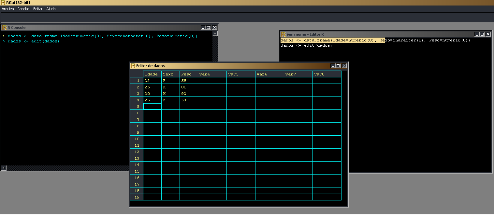
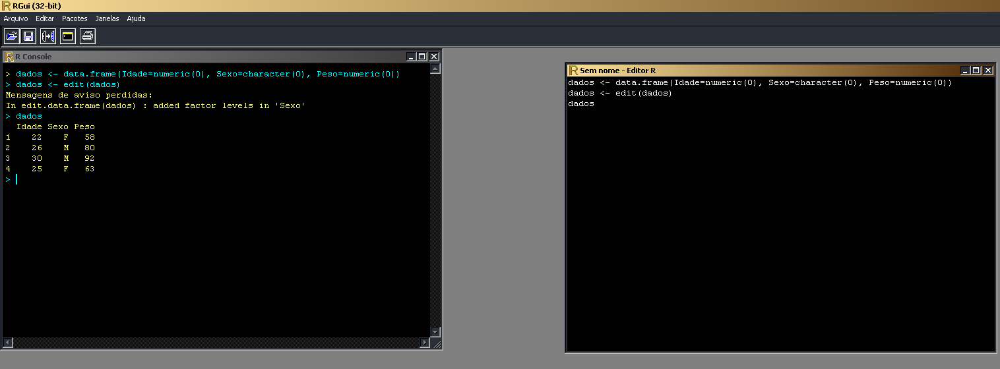

Vamos utilizar um editor, como a vizualização de folha de dados do excel para inputar nossos dados ao R.

dados <- data.frame(Idade=numeric(0), Sexo=character(0), Peso=numeric(0))
dados <- edit(dados)

Após entrar com todos os dados que necessitar, podemos simplesmente fechar o editor e teremos um data.frame salvo na variável dados =)

Depois de fechar o editor podemos chamar a variável dados e vamos obter o seguinte resultado.

Bom essa é a dica, bem simples e rápida.
