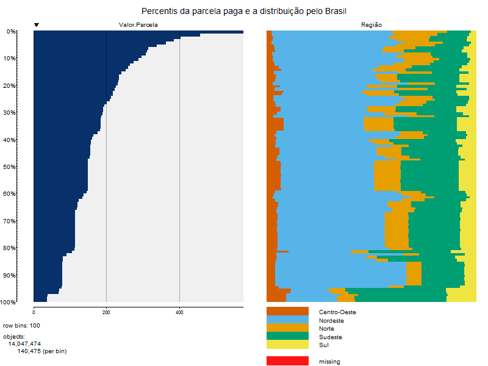
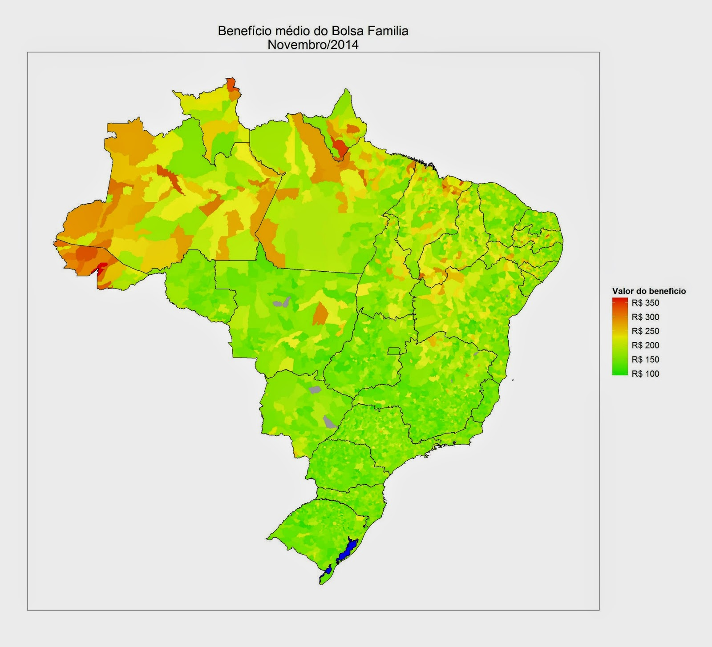

Muito se falou sobre o Bolsa Família esse ano, principalmente depois do [apertado] resultado das eleições, criticando o governo por "dar o peixe ao invés de ensinar a pescar" ou até mesmo acusando de compra de votos com dinheiro público. Mas você já parou para analisar os dados do Bolsa Família? Pois é o que vamos fazer nessa postagem!

O governo federal divulga, através do [Portal da Transparência](http://transparencia.gov.br/), os dados do CADÚnico (Cadastro único para programa sociais do governo federal) e a folha de pagamento do Bolsa Família, nome a nome, mês a mês. Com esses dados em mãos, a primeira pergunta foi: quanto custou o Bolsa Família? De janeiro a novembro de 2014, cerca de R$ 24.8 bilhões foram transferidos diretamente as famílias de baixa renda, pouco mais de R$ 2 bilhões por mês. Para termos dados mais detalhados, precisamos baixar a folha de pagamento de um específico mês. Por ser o mais recente, utilizei os dados de novembro e foram considerados somente os saques referentes à competência de novembro (quando o valor não é sacado, ele pode ser sacado nos meses seguintes)

Em novembro, foram pagos R$ 2.368.825.454 para 14.047.474 famílias, uma média de R$ 168,63 por família. Esse valor é pouco superior à mediana, que é R$ 147 - ou seja, metade das famílias cadastradas (e que sacaram em novembro) recebem R$ 147 ou menos. Esse dado pode ser confirmado pelo gráfico abaixo, que mostra os percentis dos valores repassados. Cada barra representa 1% dos beneficiários (cerca de 145 mil pessoas por barra) e o gráfico a direita mostra a distribuição desses 1% pelas 5 regiões do Brasil.

Lembra do tableplot? Falamos dele [nessa postagem](http://www.dadosaleatorios.com.br/2014/08/visualizando-grandes-bancos-de-dados.html).

Podemos facilmente notar que a região nordeste é a que possui maior número de famílias beneficiadas (com 7.128.913; 50,75% do total), seguida por Sudeste (3.485.415; 24,81%), Norte (1.688.392; 12,02%), Sul (985.182; 7,01%) e Centro-Oeste (759.572; 5,41%). Quando olhamos o valor repassado, os percentuais se alteram um pouco, mas a ordem se mantém: Nordeste (52,16%), Sudeste (22,99%), Norte (13,59%), Sul (6,30%) e Centro-Oeste (4,96%). No mapa a seguir, podemos ver o valor médio do benefício por município.

É possível notar uma uniformidade nos valores pagos em praticamente todas as regiões exceto a região Norte, que apresenta médias mais altas (o benefício médio da região foi de R$ 190), seguida por Nordeste, Sudeste, Centro-Oeste e Sul (R$ 173, R$ 156, R$ 154 e R$ 151, respectivamente). Além dos dados disponibilizados pelo portal da Transparência, o MDS também disponibiliza para pesquisadores, mediante termo de confidencialidade, a folha de pagamento do Bolsa Família com mais informações a respeito dos beneficiários: idade, endereço (para estudos intra-urbanos), descrição dos dependentes entre outras informações. Como de costume, os comandos utilizados estão disponibilizados no meu [Drive](http://goo.gl/gK3l2k). Dúvidas? Sugestões? Deixe o seu comentário!
