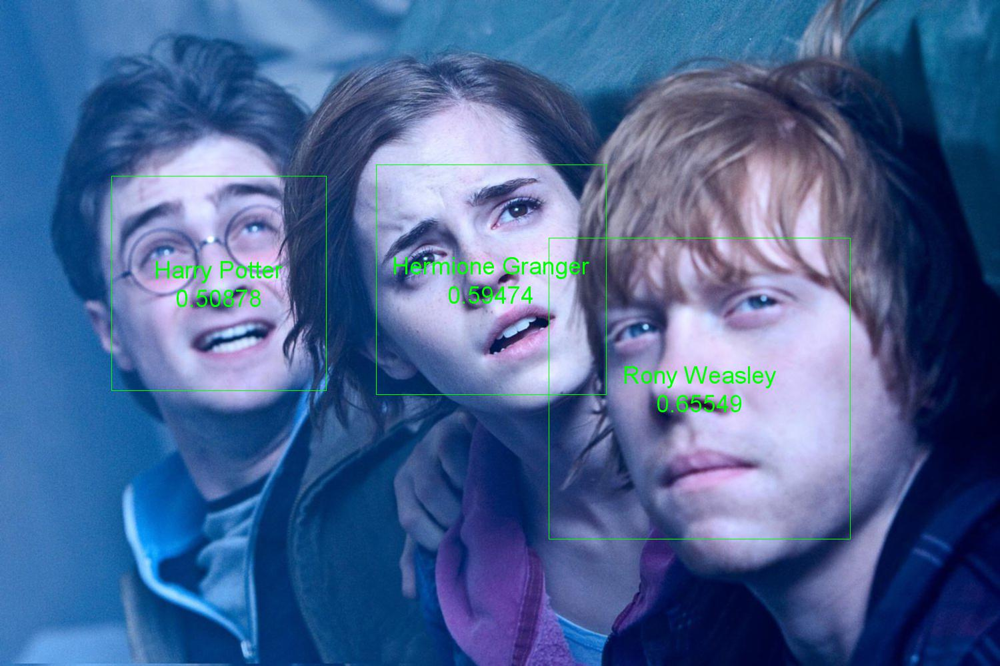
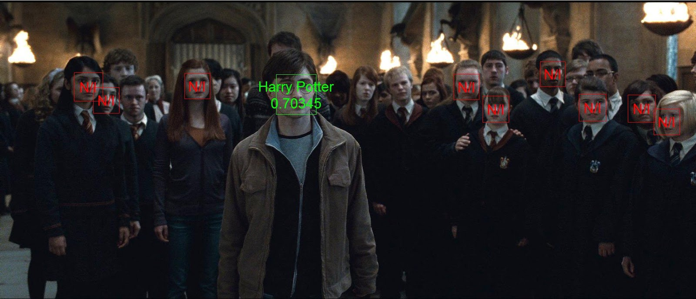

Dando sequência à [postagem anterior](http://www.dadosaleatorios.com.br/2017/01/identificando-emocoes-em-fotos.html), vamos falar um pouco agora sobre outra API do [Microsoft Cognitive Services](https://www.microsoft.com/cognitive-services/en-us/): a [Face API](https://www.microsoft.com/cognitive-services/en-us/face-api). Esta API tem como finalidade detectar rotos em fotos e analisa-los, podendo descrever características do rosto (como gênero, idade estimada, se a pessoa está de óculos, ...), informar localização de elementos faciais (olhos, boca, nariz, ...) até identificar a pessoa, comparando com rostos previamente cadastrados. Nesta postagem vamos mostrar essas 3 funcionalidades, mas dando mais ênfase na identificação de rostos.

Antes de começar, é necessário solicitar acesso à API - basta entrar no [MCS](http://www.dadosaleatorios.com.br/2017/01/identificando-emocoes-em-fotos.html) e clicar em Get started for free, selecionar a API Face - Preview e no final da página aceitar os termos de serviço e clicar em Subscribe (caso você queira rodar o código disponibilizado no final da postagem, aconselho fazer o registro antes da leitura, pois demora alguns minutos para efetivar). Você deve terminar em uma página parecida com isso:

Como exemplo, usarei fotos dos atores/personagens do último filme do [Harry Potter](http://www.imdb.com/title/tt1201607/?ref_=ttmi_tt) (juro que pensei em algo mais recente, mas não achei muitas fotos do elenco de [Stranger Things](http://www.imdb.com/title/tt4574334/)). A ideia é cadastrar os 3 principais personagens e tentar identifica-los em fotos com outros personagens. Para tal, temos que seguir as seguintes etapas (que serão explicadas com mais detalhes logo após a enumeração):

  1. Criar um grupo de pessoas
  2. Criar uma pessoa no grupo
  3. Associar uma face a pessoa (pode ser repetido diversas vezes para a mesma pessoa)
  4. Treinar para reconhecer os rostos das pessoas no grupo
  5. Identificar pessoas nas fotos
Continue lendo para ver como podemos fazer esses passos no R!

Assim como vimos para a API Emotion, todas ações são bastante simples de serem executadas, necessitando apenas poucos comandos (quando não apenas 1) para serem chamadas. Abaixo estão os comandos das duas primeiras etapas.

`
key <- 'a9552de324fd4d9796014d64250b4d58' # Chave de acesso da API'
GrupoID <- 'atoresharrypotter' # ID do grupo de pessoas que iremos criar.`
`library(httr) # Carrega o pacote httr

# Cria o grupo 'atoresharrypotter'
httr::PUT(  url = sprintf("https://westus.api.cognitive.microsoft.com/face/v1.0/persongroups/%s", GrupoID),
  httr::content_type('application/json'),
  httr::add_headers(.headers = c('Ocp-Apim-Subscription-Key' = key)),
  body = list(name = "Harry Potter e as Relíquias da Morte - P. 2",
   userData = "Grupo com os principais personagens de Harry Potter e as Relíquias da Morte - Parte 2"),
  encode = 'json')

# Cria a pessoa 'Harry Potter'
HarryPotter <- httr::POST(
  url = sprintf("https://westus.api.cognitive.microsoft.com/face/v1.0/persongroups/%s/persons", GrupoID),
  httr::content_type('application/json'),
  httr::add_headers(.headers = c('Ocp-Apim-Subscription-Key' = key)),
  body = list(name = "Harry Potter",
   userData = "Personagem que da nome a série de livros."),
  encode = 'json') `
`
``HarryPotterID <- content(HarryPotter)$personId # Armazena o ID da pessoa
`

Para associar uma face a uma pessoa nós temos duas opções: utilizar uma foto em que só aparece 1 pessoa ou utilizar uma foto que aparecem mais de 1 pessoa. Todas utilizam o mesmo procedimento da API, sendo que o com mais de 1 pessoa na foto requer um parâmetro a mais, que é o retângulo no qual a face se encontra (que pode ser obtido previamente com o procedimento detect, que usaremos mais abaixo). Importante ressaltar que é possível informar mais de 1 face para uma pessoa, melhorando assim a acurácia do algoritmo.

``

`httr::POST( url = sprintf("https://westus.api.cognitive.microsoft.com/face/v1.0/persongroups/%s/persons/%s/persistedFaces", GrupoID, HarryPotterID),`

``

`   httr::content_type('application/json'),`

``

`   httr::add_headers(.headers = c('Ocp-Apim-Subscription-Key' = key)),`

``

`   body = list(url = "https://goo.gl/6qYGKG"),`

``

`   encode = 'json')`
`
`

``Após cadastrarmos todas as pessoas e suas faces, devemos dar o comando para que a API treine, procedimento que pode ser realizado com o comando abaixo

`httr::POST(    url = sprintf("https://westus.api.cognitive.microsoft.com/face/v1.0/persongroups/%s/train", GrupoID),
            httr::content_type('application/json'),
            httr::add_headers(.headers = c('Ocp-Apim-Subscription-Key' = key)),
            encode = 'json')`

Agora o último passo: identificar pessoas em fotos. Esse passo é dividido em duas etapas: localizar as faces em uma foto e identificar a quem pertence estas faces. Acredito que esse procedimento tenha que ser feito em duas etapas devido a limitações da API: enquanto a primeira etapa localiza até 64 faces na foto, só é possível identificar 10 pessoas por vez. Ao enviar uma foto para detectar faces, cada face recebe um id único, que será utilizado para o reconhecimento facial. Para realizar essas duas etapas, são necessários os seguintes comandos:

`fotoAlvo_1 <- httr::POST(url = "https://westus.api.cognitive.microsoft.com/face/v1.0/detect?returnFaceId=true&returnFaceLandmarks=false",
                httr::content_type('application/json'),
                httr::add_headers(.headers = c('Ocp-Apim-Subscription-Key' = key)),
                body = list(url = "https://goo.gl/5k77Hq",
                    returnFaceLandmarks = TRUE),
                encode = 'json')

idAlvos_1 <- mapply(function(x) unlist(x['faceId']), content(fotoAlvo_1))
faces_1 <- mapply(function(x) unlist(x['faceRectangle']), content(fotoAlvo_1))

# Identificando as faces localizadas na foto
resultado_1 <- httr::POST(url = "https://westus.api.cognitive.microsoft.com/face/v1.0/identify",
                httr::content_type('application/json'),
                httr::add_headers(.headers = c('Ocp-Apim-Subscription-Key' = key)),
                body = list(personGroupId = GrupoID,
                faceIds = idAlvos_1,
                maxNumOfCandidatesReturned = 1,`
``                confidenceThreshold = 0.5`),
                encode = 'json') `

`
`

No procedimento identify é possível passar alguns parâmetros, tais como a quantidade de chutes desejados (maxNumOfCandidatesReturned, com valor padrão igual a 1) e a confiança dessa identificação (confidenceThreshold, com valor padrão igual a 0,5). Essa confiança é um número que varia de 0 a 1, e quanto maior, mais precisa a API considera a identificação. Valores inferiores a essa confiança são descartados da lista de candidatos. Importante destacar que as pessoas são identificadas de maneira independentes, podendo uma mesma pessoa ser identificada em mais de 1 face (como em reflexos, irmãos gêmeos ou até mesmo com valores baixos de confiança)

### Exemplos

Preparamos 3 exemplos para mostrar para vocês. Para cada pessoa foi cadastrada uma única face, e colocamos nas imagens o nome identificado junto com a confiança dessa identificação - N/I significa que o rosto não foi identificado dentre os registrados.

E aí, o que achou dessa API? Como podemos ver nos exemplos, o resultado é bastante satisfatório. Ela ainda tem outras funcionalidades que ficaram para as próximas postagens. Os códigos utilizados estão no [GitHub](https://github.com/rcoster/blog/blob/master/Identificando%20emo%C3%A7%C3%B5es%20em%20fotos). Dúvidas? Sugestões? Deixe seu comentário!
