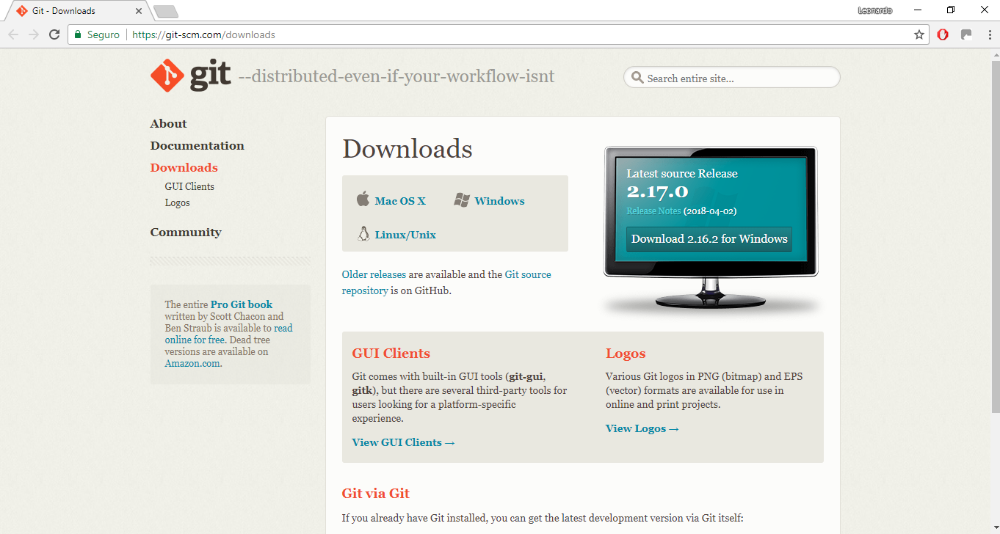
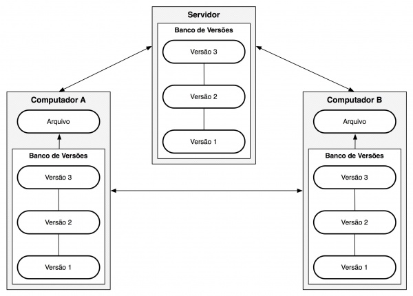
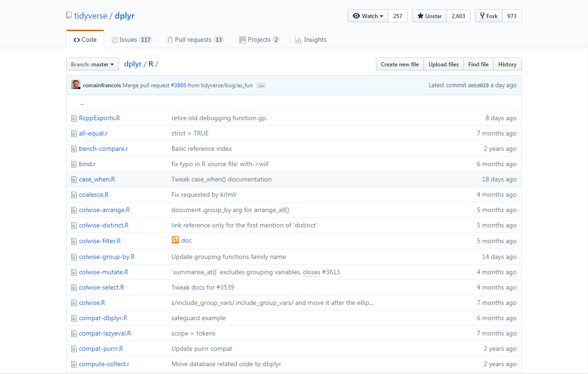
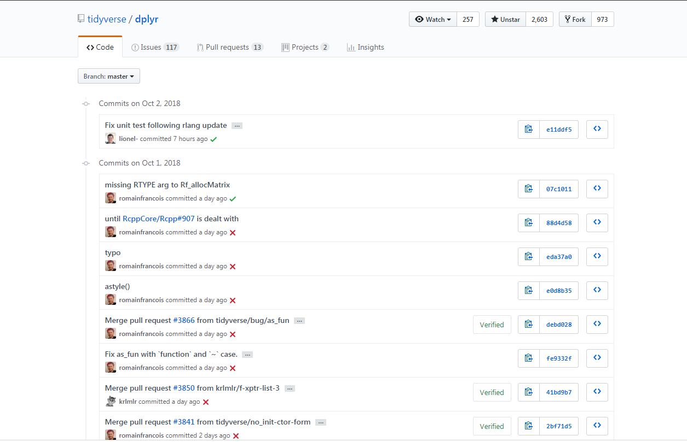
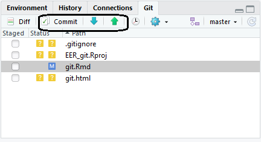
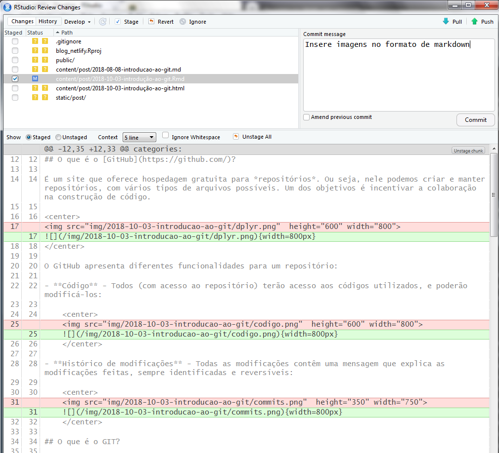

## O que é o GIT?  

No cotidiano de nossas tarefas acabamos por criar varias "versões finais" dos nossos projetos, como ilustrado abaixo. O sistema de controle de versão GIT vem pra ajudar a organizar essa nossa bagunça de versões.


Git é um sistema de controle de versão. Mas o que é controle de versão?

Os sistemas de controle de versão (VCS) registram alterações em um arquivo ou conjunto de arquivos ao longo do tempo para que você possa recuperar versões específicas mais tarde. E por que precisamos do controle de versão?

- Trabalhar simultaneamente.
- Evitar conflitos em alterações.
- Manter versões.
- Retornar ou revisar versões anteriores de suas análises.
- E muito mais!

O objetivo de um VCS é garantir que todas as mudanças ocorram de maneira controlada e otimizada, mantendo o histórico de mundança com sua respectiva justificativa.

Faça [aqui](https://git-scm.com/downloads) o download do Git




## O que é o [GitHub](https://github.com/)?  

Serviço de Web Hosting compartilhado para projetos que usam o controle de versionamento Git.
Além do [GitHub](https://github.com/) podemos citar também o [GitLab](https://about.gitlab.com/) e o [Bitbucket](https://bitbucket.org/). Nesse tutorial vamos focar no GitHub

Com ele podemos criar e manter repositórios, com vários tipos de arquivos possíveis. Um dos objetivos é incentivar a colaboração na construção de código.

A idéia é que o repositório remoto fique sempre com a versão mais atualizada que se queira compartilhar. Podemos ver como funciona na imagem a seguir:




Abaixo temos um exemplo de um repositório do pacote *dplyr* hospedado no GitHub. 


O GitHub apresenta diferentes funcionalidades para um repositório:

- **Código** - Todos (com acesso ao repositório) terão acesso aos códigos utilizados, e poderão modificá-los:

    
    
    

- **Histórico de modificações** - Todas as modificações contêm uma mensagem que explica as modificações feitas, sempre identificadas e reversíveis:

    

## Configurando o GIT

**Definindo a identidade:**

Obviamente, é necessário criar uma conta no GitHub (é gratuito).
No terminal, digitamos as informações de usuário do GitHub:

```{r, engine='bash', eval = F}
git config --global user.name "nome_de_usuario"
git config --global user.email user@exemplo.com
```

A flag `--global` pode ser usada ao fazer a configuração no seu computador pessoal. Caso contrário recomendamos omitir essa flag.

## Configurando RStudio e GitHub

No RStudio, vamos em tools > Global Options > Git/SVN, clicamos em *Create RSA Key*. Clique em *View public key* e copie a key.

No GitHub, clique na sua foto > Settings > SSH and GPG Keys e cole a key copiada na caixa de texto. Coloque um título que lhe ajude a identificar de onde é a key, cole a key e confirme.  

## Clonando [repositório](https://github.com/tidyverse/dplyr)

Basta abrir a página do repositório no GitLab e copiar o endereço destacado:


Com essa informação copiada, abrimos o RStudio, File > New Project. Selecionamos *Version Control*, escolhemos *Git* e colamos a *url* do repositório.

## Fazendo e obtendo modificações

Tendo clonado o projeto com sucesso, irá aparecer esta nova aba no RStudio, chamada Git:



Com isto poderemos facilmente realizar as 3 tarefas cotidianas ao trabalhar com Git. São elas:

- *Pull*
- *Commit*
- *Push*

### Pull

*Puxa* as modificações do repositório remoto (GitHub). Precisamos dar pull para atualizar o repositório antes de enviar modificações. 


### Commit

É a modificação dos arquivos, juntamente com uma mensagem de modificação. Basicamente, iremos contextualizar as mudanças feitas no código. 



Existe toda uma discussão sobre boas práticas ao escrever uma mensagem de commit, mas não é o objetivo deste post. 

### Push

Ao dar um commit, nada é atualizado no repositório remoto, apenas no local. Para enviar os commits ao repositório remoto (caso o dono do repositório nos autorize a fazer isso), é necessário dar um *push*. Após dar push, os commits serão enviados para o repositório remoto.

É importante o repositório estar atualizado, caso contrário o push retornará um erro. Na mensagem de erro, o Git sugere que seja dado um *pull* antes do *push*.


## Veja também:

http://rogerdudler.github.io/git-guide/index.pt_BR.html 

Gostou do post? Diga o que achou nos comentários. Comente também suas dúvidas e sugestões.