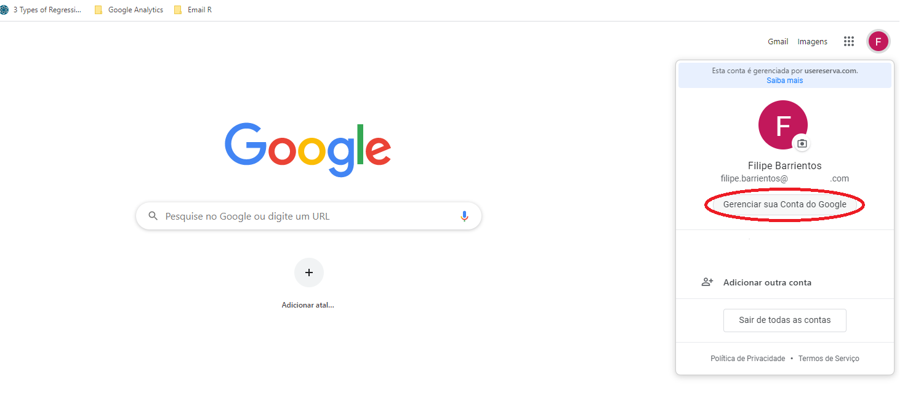
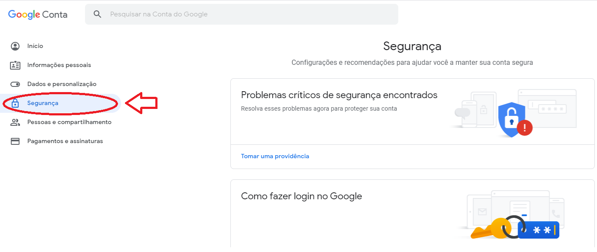
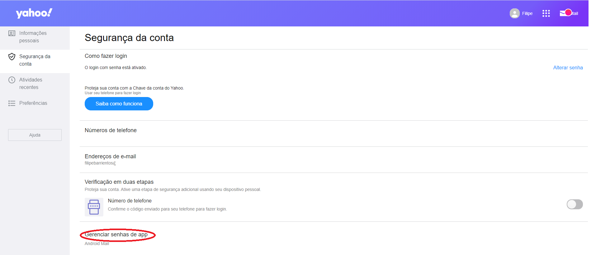

## Utilizando o R para enviar e-mails  

  Olá galera, meu nome é Filipe Barrientos e esta é a primeira vez que escrevo para este blog (ou para qualquer outro), e caso vocês estejam lendo significa que foi aprovado e que ficou legal, então aproveitem o conteúdo.  

Hoje vou falar em como enviar e-mails utilizando R, apesar de não ser algo muito comum, pode ser algo bem útil para utilizar associado a um dashboard em Shiny ou caso precise recolher e trabalhar com dados por API e já queira enviar o resultado no mesmo processo.

### Pacotes de Envio de Email

O R possui alguns pacotes que podemos usar para isto, como por exemplo:

* mailR
*	gmailr
*	blastula
*	blatr
*	mail
*	sendmailR

todos realizam a mesma tarefa, com pequenas variações de funções e em como são passado os parâmetros, porém o racional é o mesmo, para este artigo exemplifiquei com base no “mailR”, mas sintam-se a vontade de utilizar o pacote que preferirem.

> Caso tenha problemas no pacote "rJava", para resolver este basta fazer o download da última versão através deste [link](https://www.java.com/en/download/), se ainda assim não funcione você pode redirecionar para a pasta que você instalou antes de chamar o pacote. 
Pode ser visto [aqui](https://www.r-statistics.com/2012/08/how-to-load-the-rjava-package-after-the-error-java_home-cannot-be-determined-from-the-registry/) ou se estiver utilizando ubuntu [aqui](https://datawookie.netlify.app/blog/2018/02/installing-rjava-on-ubuntu/)

```{r eval=FALSE}
install.packages("mailR")
install.packages("rJava")
require(mailR)
require(rJava)
```


### Função e principais Parâmetros  

Após tudo instalado corretamente, ao digitar *__mailR::__* vai notar que a lista de funções só tem uma, chamada __send.mail()__, então tente adivinhar qual função usaremos, caso tenha respondido __send.mail()__ meus Parabéns!! Você está prestando atenção (se respondeu outra coisa sugiro começar a ler novamente do início).

Tudo bem, então é bem simples, afinal o pacote só possui uma função e a mesma vai fazer o que eu quero, mas a parte que pode envolver um pouco mais de esforço é na hora de passar os parâmetros, os principais que serão utilizados são:

* __from__: E-mail de por onde deve ser enviada a mensagem; 
* __to__: E-mail de quem deve receber;
* __subject__: Assunto sobre o qual se trata o e-mail, afinal não se manda e-mail sem assunto;
* __body__: A mensagem propriamente dita, podendo ter texto ou imagens no próprio corpo do e-mail também;
* __html__: Um parâmetro booleano, sugiro que sempre definam como "TRUE", sendo assim o corpo do e-mail será "parsed" como HTML
* __inline__: Também booleano que deve ser posto como TRUE, pois ele que irá permitir que imagens apareçam no corpo do e-mail;
* __smtp__: Receberá um list() com alguns parâmetros de configuração para acessar o servidor SMTP do e-mail que enviará a mensagem; 
  + *__host.name__*: Este aqui você terá que procurar qual o smtp do e-mail que você utiliza, o gmail por exemplo é: *smtp.gmail.com*, caso trabalhe em uma empresa com gmail personalizado, costuma funcionar substituir o "*gmail*" pelo nome utilizado, exemplo: meu email é "*filipe@Empresa_Peixola.com*" o smtp seria: *smtp.Empresa_Peixola.com*;
  + *__port__*: É a porta utilizada para acessar o servidor, 587 costuma ser padrão;
  + *__user.name__*: Aqui você entrará com o e-mail que você utilizou lá no __from__;
  + *__passwd__*: A senha costuma ser a mesma que você utiliza para acessar o e-mail, porém pode depender do email que está sendo utilizado, o YAHOO possui uma senha de verificação para acesso externo, enquanto contas GMAIL apesar de ser a mesma senha você deve modificar o nível de segurança antes, mas abaixo explico melhor o processo de acesso de ambos e terão links de referência.
  + *__tls__*: É o tipo de segurança criptográfica do e-mail, deve receber "*TRUE*", caso precise pode substituir pelo *__ssl__*.
* __authenticate__: Outro booleano que deve ser mantido como "TRUE", ele indica se o servidor SMTP requisita autenticação, que são a maioria;
* __attach.files__: O caminho de algum arquivo que desja enviar em anexo.

Abaixo segue alguns links para ajudar a identificar o SMTP do seu e-mail e testar:  

-  [*Lista com alguns SMTPs de provedores de e-mail mais usados*](https://serversmtp.com/pt-pt/servidores-smtp/)  
- [*Site para testar configuração de envio email*](https://www.smtper.net/)

Após todos os parâmetros terem sido verificados e passados corretamenteo código ficará parecido com estes:   

__Exemplo 1__: Envio de e-mail Yahoo com imagem em arquivo anexo e no corpo da mensagem.

```{r eval=FALSE}
send.mail(from="XXXXX@yahoo.com.br",
          to="YYYYY@gmail.com",
          subject="Test Email",
          body='Segue a Imagem: ',
          html=TRUE,
          inline= TRUE,
          smtp=list(host.name = "smtp.mail.yahoo.com",
                    port = 587,
                    user.name = "XXXXX@yahoo.com.br",
                    passwd = "Senha_Gerada_Para_Acesso_Por_APP",
                    tls = T),
          authenticate=T,
          attach.files="~/Imagens/2020-01-27.png")
```

__Exemplo 2__: Envio de e-mail Gmail, com imagem somente como arquivo em anexo.

```{r eval=FALSE}
send.mail(from="YYYYY@gmail.com",
          to="XXXXX@yahoo.com.br",
          subject="Test Email",
          body="Segue a Imagem:",
          html=TRUE,
          inline= TRUE,
          smtp=list(host.name = "smtp.gmail.com",
                    port = 587,
                    user.name = "YYYYY@gmail.com",
                    passwd = "Senha_do_Proprio_E-mail",
                    tls = T),
          authenticate=T,
          attach.files="~/Imagens/2020-01-27.png")
```


### Configuração de Segurança para Conexão

Como dito anteriormente, ao explicarmos o *__passwd__*, alguns detalhes de acesso por terceiros devem ser configurados antes, ou pode ser que você não consiga fazer ele se conectar ao servidor SMTP, começremos pelo __GMAIL__ então:

__1__- Entre em "Gerenciar sua Conta do Google" da conta que você irá utilizar  



__2__- Agora clique na aba "Segurança"  



__3__- Deslizando a página para o fim você achará um bloco com título "Acesso a app menos seguro", onde provavelmente estará desativado, é somente ativar e pronto poderá realizar o acesso agora.


O processo de acesso do __YAHOO__ é bem parecido, somente modificará que ele te disponibilizará uma senha para acesso por app: 

__1__- Entre neste [link](https://login.yahoo.com/account/security) que você será redirecionado direto para a págna de segurança e clicará no último quadro.



Quando clicar lá você seguirá as instruções, dará um nome para a applicação que vai utilizar esta senha e pronto vai colocar ela no *__passwd__*.
 
Mais informações podem ser vistas [aqui](https://www.r-bloggers.com/mailr-smtp-setup-gmail-outlook-yahoo-starttls/)

### Dicas e Exemplos de Aplicação

Provavelmente depois de tudo isto alguns devem estar ainda se perguntando de porque fazer todo este processo se eu posso simplesmente entrar no e-mail ou até mesmo programar o envio automático pelo próprio e-mail mesmo e a resposta é que ele funciona muito bem em conjunto com um ShinyDashboard enviando e-mails de alerta para os responsáveis quando algum indicador atinge algum nível de atenção.

Outro exemplo pode ser o uso de automatizar o envio periódico de resultados de uma empresa para o e-mail de colaboradores que não possuem acesso ao dasboard por seja qual for o motivo, e com um pouco de imaginação sei que acharão diversas outras situações.

### Resumo

Em resumo explicamos quais os parâmetros que devem se ter em mãos para configurar o envio de e-mail pelo R, alguns exemplos de como deve ficar o código e um breve guia de como permitir a conexão nos servidores dos e-mails, se você chegou até aqui espero muito que tenha conseguido sanar suas dúvidas e se der tudo certo até a próxima! 