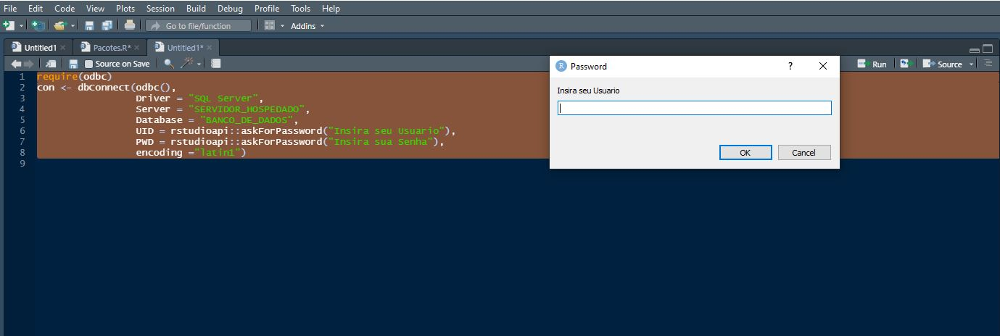

```{r setup, include=FALSE}
knitr::opts_chunk$set(echo = TRUE)
```

  Olá galera, Filipe Barrientos mais uma vez por aqui, neste post vou dar uma explicação de como conectar a um banco do SQL Server e realizar uma query utilizando o R. 
  
  É bem comum que os dados de empresas estejam em bancos de dados SQL Server ao invés de planilhas ou arquivos csv, sendo assim se torna mais simples extrair as querys diretamente para um data frame em R, do que ficar salvando as informações em arquivos diferentes para poder carrega no R. 
  
  Por conta desta e várias outras razões explicarei como faço este processo, desde a conexão ao banco de dados, realização da query.
  <!-- , e até salvar uma tabela no banco novamente. -->

### Pacotes de Conexão

  Existem alguns pacotes para fazer esta conexão, aqui abordaremos como realizar o processo com o pacote "odbc" em um sistema operacional Windows, ele é bem simples e realiza bem a tarefa, enfim entendendo a lógica geral a aplicação é bem parecida para todos os demais.


```{r eval=FALSE}
install.packages("odbc")
require(odbc)

```

### Realizando a Conexão

  Esta é a primeira parte do processo, afinal de contas para fazer uma consulta ao banco você vai precisar estar conectado no mesmo né (nossa quem diria), para realizar esta conexão vamos usar função __odbc::dbConnect()__. 
  
  A função __odbc::dbConnect()__ vai possibilita conectar ao banco de duas formas diferentes, uma é via DSN, pegando um acesso ODBC já pré-definido do seu computador, para esta forma vai utilizar os seguintes parâmetros:
  
* __drv__: Basta atribuir a função "odbc()"; 
* __dsn__: Nome da fonte de dados que já está pré-definida na máquina;
  
esta conexão ficará da seguinte forma
  

```{r eval=FALSE}
# Conectando via DSN
con <- dbConnect(odbc(), "Nome_DSN_Exemplo")

```

  A outra forma de conectar com o __odbc::dbConnect()__ é passando todos os parâmetros de conexão a fonte de dados na própria função, esta função possui uma infinidade de parâmetros, porém para uma conexão padrão os parâmetros listados abaixo são suficientes:
  
* __drv__: Basta atribuir a função "odbc()"; 
* __Driver__: O nome do driver o qual você irá conectar, no caso vamos focar no driver "SQL Server";
* __Server__: Aqui você colocará o nome do server do SQL Server que você deseja conectar;
* __Database__: Este aqui é o nome do banco de dados("DataBase") onde se encontram as tabelas de interesse;
* __UID__: O usuário com permissão de acesso ao banco de dados("DataBase") escolhido;   
* __PWD__: A senha deste usuário;
* __encoding__: Este é um parâmetro opcional, porém é sempre bom configurar de acordo com seu banco por preocaução;  
  
desta forma podemos usar como referência o exemplo abaixo, para realizar a conexão:
  
```{r eval=FALSE}
# Conectando via definição dos parâmetros
con <- dbConnect(odbc(),
                       Driver = "SQL Server",
                       Server = "SERVIDOR_HOSPEDADO",
                       Database = "BANCO_DE_DADOS",
                       UID = "USUARIO",
                       PWD = "SENHA",
                       encoding ="latin1")

```  
  
porém o exemplo acima possui um problema no quesito de segurança, caso esteja se conectando em um banco de dados de informações sensíveis, não é uma boa idéia deixar no seu código explicitamente o "UID" e o "PWD", ainda mais se esta conexão fizer parte de uma aplicação shiny ou algo do gênero.

  Para garantir que somente usuários autorizadas terão acesso a esta conexão, ao invés de atribuir diretamente no código um "usuário" e "senha", coloque a função  __rstudioapi::askForPassword()__, no caso esta função abrirá um prompt requisitando que coloque um valor, neste caso será o "usuário" e "senha". Seguindo este método a conexão terá a seguinte estrutura:

```{r eval=FALSE}
# Conectando requerindo acesso individual
con <- dbConnect(odbc(),
                       Driver = "SQL Server",
                       Server = "SERVIDOR_HOSPEDADO",
                       Database = "BANCO_DE_DADOS",
                       UID = rstudioapi::askForPassword("Insira seu Usuario"),
                       PWD = rstudioapi::askForPassword("Insira sua Senha"),
                       encoding ="latin1")

```  

desta forma ao executar o código, ele abrirá duas caixas de diálogos em sequência, uma requisitando o Usuário e outra a senha de quem estiver entrando, assim qualquer um que não possua nivel de acesso para o banco de dados em questão não conseguirá conectar, mantendo seus dados seguros.

  Para exemplificação, abaixo estão imagens das caixas de diálogos que aparecem ao executar o código:



percebam que o texto é personalizável, permitindo que coloque o texto que você preferir.

### Executando A Query

  Agora que fizemos a conexão com o banco de dados que será consultado, chegou a hora de trazer os dados para um data.frame no R, onde poderemos fazer análises e tratamentos que quisermos.
  
  Para realizar tal consulta vamos usar a função __odbc::dbGetQuery()__, onde passaremos dois parâmetros:
  
* __conn__: Que vai receber a conexão com o banco de dados que foi estabelecido, no nosso caso o objeto "con"; 
* __statement__: Aqui em forma de texto deve ser posto a query desejada;

para facilitar o entendimento do código, particulamente, costumo atribuir o texto da query a um objeto nomeado de acordo, como "QUERY_VENDAS", para então colocar o objeto na parte do __statement__ da função, como é possível observar no exemplo abaixo:

```{r eval=FALSE}
# Realizando Query
QUERY_VENDAS <- paste0(
    "SET NOCOUNT ON
    SET ANSI_WARNINGS OFF
  
    SELECT	*
    FROM VENDAS
    
    SET NOCOUNT OFF
    SET ANSI_WARNINGS ON"
  )
  
  VENDAS <- dbGetQuery(con, QUERY_VENDAS)

```  

e este simples código acima já estaria atribuindo o resultado da query ao data.frame "VENDAS", com a ajuda de outras funções do pacote __odbc__ tais como __dbWriteTable()__, __dbSendQuery()__ entre outros é possível fazer um universo de coisas no banco de dados pelo R.    

### Dicas de Aplicação

Uma boa forma de aplicação que encontrei da combinação destas ferramentas, foi em intermediar o processo de ETL da empresa onde trabalho.

Uma boa forma de realizar alguns tratamentos mais complexos e salvar uma nova tabela já com os tratamentos aplicados é exatamente realizando a conexão ao banco pelo R, então você pode ter o script que for que trate dados estruturados de onde você quiser e da forma que for, pegando de api do Google Analytics ou até de querys do banco SQL mesmo, que o data frame final desejado você pode gravar na tabela no banco, tanto sobrescrevendo a anterior ou realizando um insert.

E esta é somente uma de um, como dito anteriormente, universo de coisas que será possível que você venha fazer sabendo e tendo criatividade para utilizar as combinações de funções que são possíveis, talvez facilitando muitas automatizações suas de hoje em dia.

### Resumo

Em resumo explicamos quais os parâmetros que devem se ter em mãos para configurar uma conexão a um banco SQL SERVER, de duas maneiras diferentes, e como realizar uma query a este banco, se você chegou até aqui espero muito que tenha conseguido sanar suas dúvidas e se der tudo certo até a próxima! 

