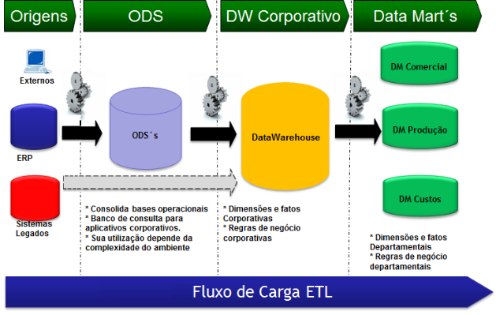

```{r setup, include=FALSE}
knitr::opts_chunk$set(echo = TRUE)
```

## Processo de ETL na construção de um DW 

  Fala galera, eu sou o Filipe Barrientos e neste artigo vou elucidar sobre as etapas do processo de Carga ETL na construção de um DataWarehouse(DW). 
  
  Onde trabalho surgiu o desafio de estar a frente da equipe de BI, juntamente a responsabilidade de construir um DataWarehouse, devido a isto pratiquei diversas skills que normalmente um Cientista ou Analista de Dados só trabalham mais superficialmente, o que me fez entender melhor o trabalho dos Engenheiros de Dados, além de me colocar a par de todo fluxo de analise. 

  Antes de começarmos, porém, devo agradecer ao grande Mestre Bruno Lucian que está me dando este espaço aqui e ao Bruno Salles, um grande profissional com quem tive o prazer de trabalhar e que me ensinou boa parte das práticas que falarei aqui.

### ETL quem? DW o quê?

  Para incio de conversa vamos explicar o significado das siglas ETL e DW, que são:
  
* **ETL**: **E**xtract, **T**ransform, **L**oad. 
* **DW**: **D**ata**W**arehouse.

  Bom agora que já sabem o que significam as siglas está tudo explicado né, ainda não? 

{width=220 height=146}

  Então tudo bem explicarei um pouco mais os conceitos de cada um, vamos começar pelo ETL então.
  
  O ETL é o processo de integração dos dados que vai viabilizar a construção do DW e como o nome já indica, passar por três etapas:
  


@. **Extract**

Começamos com a extração dos dados das diversas fontes que eles possam estar e juntamos todos em tabelas em um único banco de chamado ODS(Operational data store) que será basicamente uma cópia dos dados operacionais que são do nosso interesse.

@. **Transform**

Vamos depois para transformação das tabelas já no ODS em tabelas de dimensões e fatos, criando assim uma estrutura de fatos e dimensões, aplicando as regras de negócios necessárias e padronizando os formatos.

@. **Load** 

Finalizando realizamos a carga da estrutura de fatos e dimensões que criamos, assim materializando as tabelas para o banco do DW. 

  Após efetuado a Carga ETL, teremos um DW com a estrutura ideal para ser acessada por ferramentas de BI e por outros analistas da empresa.

  Abaixo temos uma figura que ilustra bem o fluxo da Carga ETL, desde os dados brutos até o DW, nota-se que ela engloba um passo a mais que são os Data Marts, de forma bem resumida, estes seriam como subgrupos do DW com um foco especializado para cada departamento.



  Não se preocupem se ainda não ficou totalmente claro como realizar o ETL, pois o importante é compreender a ordem que acontece e qual a função de cada etapa o resto é prática.

  Uma vez que o ETL é o processo que pega o dado bruto e o trata para armazenar no DW, o que é este DW onde são levadas estas informações? O DW, como o nome já diz, é o "Armazém de Dados (DataWarehouse)" da empresa, onde se encontram centralizadas e tratadas todas as informações de relevância analítica, ele também possui uma estrutura que visa facilitar o acesso e entendimento dos analistas e consultas das ferramentas de BI, a estruturação mais comum é a de tabelas de Fatos e Dimensões, também chamado de Modelo Estrela(Star Schema).
  
### Fatos, Dimensões e um Modelo que é a "Estrela" do Show (eita piada ruim)

{width=220 height=146}
  
  A estrutura do Modelo Estrela se baseia em dividir todos os dados transacionais e informações cruas, aqueles que foram extraidos para o ODS, em dois tipos de tabelas:
  
  * **Fatos**: São as métricas como valores de venda, número de atendimentos e outras variáveis quantitativas, que servem para calcular os indicadores, além das colunas chaves das dimensões, que definem a granularidade possível de se alcançar para estes valores.
  
  * **Dimensões**: São as variáveis descritivas dos atributos associados as Fatos, elas vão possibilitar as diferentes visões de um indicador, pois nelas estão, por exemplo, produtos, filiais, clientes, e seus detalhes como Grupo_Produto, Nome_Filial, Endereço consecutivamente. Além das citadas, ela também possui uma coluna chave, que será um ID único por cada combinação de atributos(cada linha) que é a que fará o cruzamento com a tabela Fato. 
  
  Como exemplo vamos fazer uma tabela transacional fictícia e mostrar como ela se transformaria em tabelas de Fatos e de Dimensões, não iremos aplicar os tratamentos da Carga ETL somente a lógica de Fatos e Dimensões.

  Para começar vamos exemplificar uma tabela transacional que já esteja no ODS, vamos chamá-la de "tb_ODS_Exemplo_Venda":

```{r echo = FALSE, results = 'asis'}
library(knitr)

exemplo_ods <- data.frame(ValorVenda      = c(918,530,681,696,583,692),
                          QuantidadeVenda = c(1,1,1,1,2,2),
                          CodPedido       = c("P_1","P_1","P_1","P_1","P_1","P_2"),
                          CodFilial       = c("F_A","F_B","F_C","F_C","F_D","F_D"),
                          CodCliente      = c("C_A","C_B","C_C","C_C","C_D","C_E"),
                          CodVendedor     = c("V_A","V_B","V_C","V_C","V_D","V_E"),
                          CodProduto      = c("PROD_A","PROD_B","PROD_C","PROD_D","PROD_E","PROD_F"))


kable(exemplo_ods, caption = "tb_ODS_Exemplo_Venda",
      col.names = c("Valor Venda","Quantidade Venda","Cod Pedido","Cod Filial","Cod Cliente","Cod Vendedor","Cod Produto"))


```

  
  acima temos a tabela na sua forma original, é possível ver que a mesma possui duas métricas(`Valor Venda` e `Quantidade Venda`) e cinco dimensões(`Cod Pedido`, `Cod Filial`, `Cod Cliente`, `Cod Vendedor`, `Cod Produto`), uma regra de negócio(para fins de exemplo) que vamos considerar é que tivemos que fazer uma dimensão de pedido pois o mesmo `Cod Pedido` pode existir em `Cod Filiais` diferentes, e a combinação única será `Cod Pedido+Cod Filial+Cod Cliente`, pois no caso de ele já ser um identificador geral único, não haveria necessidades de criar uma tabela de dimensão somente para ele.
  
  Agora que já temos um exemplo de dados transacionais, vamos mostrar as tabelas de dimensões que existiriam para esta situação:

  
```{r echo = FALSE, results = 'asis'}
library(knitr)

exemplo_ods <- data.frame(IdPedido        = 1:5,
                          CodPedido       = c("P_1","P_1","P_1","P_1","P_2"),
                          CodFilial       = c("F_A","F_B","F_C","F_D","F_D"),
                          CodCliente      = c("C_A","C_B","C_C","C_D","C_E"))


kable(exemplo_ods, caption = "tb_Dim_Pedido",
      col.names = c("IdPedido","Cod Pedido","Cod Filial","Cod Cliente"))


```  

```{r echo = FALSE, results = 'asis'}
library(knitr)

exemplo_ods <- data.frame(IdFilial        = 1:4,
                          CodFilial       = c("F_A","F_B","F_C","F_D"),
                          UF              = c("RJ", "SP", "MG", "AC"),
                          Localizacao     = c("SHOPPING","SHOPPING","RUA","RUA"))


kable(exemplo_ods, caption = "tb_Dim_Filial",
      col.names = c("IdFilial","Cod Filial","UF","Localização"))


```  

```{r echo = FALSE, results = 'asis'}
library(knitr)

exemplo_ods <- data.frame(IdCliente   = 1:5,
                          CodCliente  = c("C_A","C_B","C_C","C_D","C_E"),
                          CPF         = c("0001","0002","0003","0004","0005"),
                          Sexo        = c("M","M","F","F","M"),
                          Idade       = c(27,47,31,22,30))


kable(exemplo_ods, caption = "tb_Dim_Cliente",
      col.names = c("IdCliente","CodCliente","CPF","Sexo","Idade"))


```  

```{r echo = FALSE, results = 'asis'}
library(knitr)

exemplo_ods <- data.frame(IdVendedor  = 1:5,
                          CodVendedor = c("V_A","V_B","V_C","V_D","V_E"),
                          Supervisor  = c("S_A","S_A","S_B","S_C","S_D"))


kable(exemplo_ods, caption = "tb_Dim_Vendedor",
      col.names = c("IdVendedor","Cod Vendedor","Supervisor"))


```  

```{r echo = FALSE, results = 'asis'}
library(knitr)

exemplo_ods <- data.frame(IdProduto       = 1:6,
                          CodProduto      = c("PROD_A","PROD_B","PROD_C","PROD_D","PROD_E","PROD_F"),
                          Marca           = c("M_EX","M_EX","M_EMPLO","M_EMPLO","M_EMPLO","M_EMPLO"),
                          Material        = c("UNOBTAINIUUM","MITHRIL","CARBONITA","KRYPITONITA","VIBRANIUM","ADAMANTIUM"),
                          Grupo           = c("ENGENHARIA","LOTR","STARWARS","DC","MARVEL","MARVEL"))


kable(exemplo_ods, caption = "tb_Dim_Produto",
      col.names = c("IdProduto","Cod Produto","Marca","Material","Grupo"))


```  

como é possível perceber, estas tabelas possuem todos os detalhes da dimensão observada, mas podem servir também, como no caso do pedido, para facilitar na contagem, uma vez que os textos serão substítuidos pelos Id's de cada dimensão, esta alteração ajuda muito também em questão de velocidade e desempenho de leitura, uma vez que é mais rápido a leitura de uma tabela somente com valores numéricos do que com textos de diversos tamanhos.

  Agora que as tabelas de dimensão foram apresentadas, podemos ver abaixo como ficaria a tabela Fato deste exemplo:

```{r echo = FALSE, results = 'asis'}
library(knitr)

exemplo_ods <- data.frame(ValorVenda      = c(918,530,681,696,583,692),
                          QuantidadeVenda = c(1,1,1,1,2,2),
                          IdPedido        = c("1","2","3","3","4","5"),
                          IdFilial        = c("1","2","3","3","4","4"),
                          IdCliente       = c("1","2","3","3","4","5"),
                          IdVendedor      = c("1","2","3","3","4","5"),
                          IdProduto       = c("1","2","3","4","5","6"))


kable(exemplo_ods, caption = "tb_Fato_Exemplo_Venda",
      col.names = c("Valor Venda","Quantidade Venda","IdPedido","IdFilial","IdCliente","IdVendedor","IdProduto"))


```  

vejam que cada uma das variáveis que se referiam a uma dimensão foi substituida por sua respectiva chave(Id), outro ponto é a contagem de pedidos mais facilitada, antes seria necessário uma concatenação de três campos e uma contagem de objetos distintos para obtermos a este valor, já agora, basta fazermos a contagem sobre o campo de `Idpedido`, ou no caso de não haver nenhuma condição(vendas acima de, cliente específico e etc..) basta verificar o valor máximo do campo, veja que a referência de cada pedido não se perde também, pois continua existir na tabela de dimensão.
  
  Após todos estes exemplos e explicações alguns podem estar sem entender a questão do nome do modelo, afinal de contas o que tudo isto tem haver com uma "Estrela"? Basicamente o nome se dá por conta da disposição das tabelas ligadas e representadas no schema:   
  
 

e para quem estiver pensando, sim eu coloquei com cinco dimensões para que ficasse mais fácil a visualização,
{width=220 height=146}
mas é possível fazer uma fato se ligar a mais ou menos dimensões, vai depender da sua necessidade.

### Dicas para o ETL

  Agora que já passamos por toda a parte mais teórica dos conceitos, torço para que vocês estejam já entendo um pouco melhor sobre o processo de construção de um DW, mas nesta parte gostaria de compartilhar algumas dicas mais práticas da Carga ETL que me foram ensinadas e outras que fui aprendendo na prática que facilitam bastante na manutenção e para trabalhar com os dados.
  
  Então vamos dividir as dicas por cada passo respectivimanete, a partir daqui vou utiizar alguns termos do SQL SERVER, então caso não entenda algo e só dar uma google, então sem mais papo vamos dar essas dicas:
  

  * Popule as tabelas do ODS através de procedures que façam a query na produção e insiram nas tabelas do ODS, e mesmo que seja mais fácil por vezes coletar dados de api's por scripts em Python/R, não salve diretamente no ODS mas sim em outro banco para que seja carregada via procedure para o ODS, desta forma facilita o rastreio da origem das tabelas.
  
  * As procedures devem já ser criadas, quando possível, com parâmetros que possibilitem a carga completa ou incremental dos dados, afinal de contas quanto menos informações estiver trazendo de um só vez mais rápido será.  
  
  * Mesmo na etapa de Extração algumas transformações são bem vindas, como a padronização de todos os campos, aplicando pequenos tratamentos como LTRIM e RTRIM em campos de textos, convertendo números em int ou float e datas para DateTime, além dos Nomes das variáveis adaptar a um padrão, se os campos de `CodiGO_de_CLIENTE` em uma tabela virou `CodCliente`, esta mesma variável nas demais tabelas também deve seguir este padrão.
  
  * Falando em padronização é sempre bom também fazer o mesmo nos nomes das suas tabelas, procedures e views, no meu caso por exemplo minhas tabelas no ODS possuem o prefixo `tb_ODS` seguido do nome da tabela  Ex.: "tb_ODS_Exemplo_Venda", enquanto no DW as fatos e dimensões possuem respectivamente os prefixos `tb_Fato` e `tb_Dim`, Ex.: `tb_Fato_Exemplo_Venda` e `tb_Dim_Exemplo`. Desta forma se cria um padrão que facilita a vida de quem é novo, pois estamos tornando as coisas mais intuitivas.
  
  * Algumas dimensões podem sofrer atualizações cadastrais, então é sempre bom para isto as procedures responsáveis pela carga de tais tabelas serem feitas com merge sempre que for possível, assim você garante a atualização dos dados sempre, e não somente a inserção de novos.
  
  * Organize seu processo de carga ETL dentro de um projeto SSIS, desta forma você organiza melhor quem deve se carregado antes ou depois, lembrando que a ordem de carga sempre será Tabelas para o ODS, seguido da atualização das Dimensões e finalizando com a atualização das Fatos, no projeto crie containers com os nomes que facilite o entendimento.
  
  Espero que sejam úteis estas dicas, são algumas pequenas coisas que percebi ajudarem bastante durante o processo de construção, manutenção e atualização do DW.
  
### (Bônus!!)Porque ficar no armazém ao invés de mergulhar no lago?

  Alguns devem estar se perguntando porque estou falando de DataWarehouse quando o assunto quente de agora é o DataLake, como este assunto é bem extenso e com certeza daria um artigo inteiro somente para explicar e comparar estes dois, por agora me limitarei a dizer que, assim como uma regressão linear pode ser melhor que  rede neural dependendo dos seus dados, um DataWarehouse pode ser mais acessível e útil dependendo da situação.
  Em meu caso, chegamos a conclusão analisando a situação que tinhamos que era mais barato e rápido a construção de um DW, baseado nos pontos:
  
* Todos os dados eram em formato estruturados.
*	Volume de dados não era suficientemente grande para justificar uma estrutura em nuvem.
*	Os skills necessários para a construção e manutenção de um DataLake são mais complexos do que para um DataWarehouse.
*	Em alguns casos o Ambientes em nuvem pode se torna mais caro do que a criação de um banco em um servidor local.

  Por isto é importante uma boa análise da situação antes, para não acabar querendo se jogar num "Hype" sem saber se existem outras alternativas melhores para seu momento.
  
### Conclusão

  Bem pessoal isto era o que eu tinha para falar(ou escrever) sobre este assunto, sei que deixei algumas coisas de fora e não me aprofundei muito em outros pontos, mas o objetivo era mesmo dá uma visão mais geral sobre o assunto mais voltado para a galera mais iniciante mesmo, então espero que tenham gostado e se tiverem algum dica ou discordar de algum ponto, comenta ai em baixo e vamos espalhar o conhecimento entre nós. Grande Abraço!


