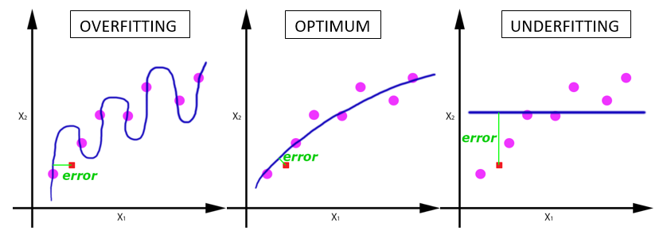

# **Overfitting e Underfitting**

**Underfitting** e **Overfitting** são termos muito importantes no ramo em machine learning. **Um bom modelo não deveria sofrer de Underfitting nem de Overfitting**, por isso precisamos entender estes conceitos, e saber identificar suas ocorrências.

No aprendizado supervisionado, os modelos são treinados em um subconjunto de dados com labels. Com a intenção de generalizar o aprendizado para fora desse subconjunto.

O **underfitting** pode ser visto quando nosso modelo é muito simples para explicar a variação apresentada pelos dados. Como podemos ver no ultimo gráfico da imagem acima. Esse modelo também é visto como um modelo de grande _viés_ (high bias).

O **overfitting**  como podemos observar no primeiro gráfico, mostra a linha prevista cobre todos os pontos no gráfico. Nessa condição, podemos pensar que é um bom modelo, pois, cobre todos os pontos sem erro algum. Mas isso não é verdade, a linha prevista no gráfico abrange todos os pontos que são ruídos e discrepantes. Esse modelo também é responsável por prever resultados ruins devido à sua alta complexidade, também chamado de alta _variância_ (high variance).

Quando o modelo aprende sinais e ruídos nos dados de treinamento e não tem um bom desempenho em novos dados sobre os quais o modelo não foi treinado.

Na relaçao viés e variância temos que, o viés é reduzido e a variação aumenta em relação à complexidade do modelo. Quanto mais parâmetros são adicionados a um modelo, a complexidade do modelo aumenta e a variação se torna nossa principal preocupação, enquanto o viés diminui constantemente.

Agora que já sabemos identificar o que é **under** e **overfitting**, há algumas maneiras de evitar o **overfitting** de seu modelo em dados de treinamento, como amostragem em **validação cruzada**, **redução do número de variáveis**, **regularização**, etc. E vamos, a seguir, elencar uma série de técnicas que podemos aplicar afim de diminuir nossas chances de criar modelos que não são possiveis de generalizar para dados fora do conjunto de treino.

Não existe um método de **validação cruzada** único que funcione em todos os cenários. É importante entender se você está lidando com grupos, dados indexados por tempo ou se está vazando dados no seu procedimento de validação. Abaixo podemos ver alguns dos principais métodos disponíveis:

* _Train/test split_
* _k-Fold Cross-Validation_
* _Leave-one-out Cross-Validation_
* _Leave-one-group-out Cross-Validation_
* _Nested Cross-Validation_
* _Time-series Cross-Validation_
* _Wilcoxon signed-rank test_
* _McNemar’s test_
* _5x2CV paired t-test_
* _5x2CV combined F test_

O processo de r**edução do número de variáveis** pode ser feito de diversas formas, cada qual com sua peculiaridade, a seguir vamos pontuar os mais conhecidos.

* _Missing Values Ratio_
* _Low Variance Filter_
* _High Correlation Filter_
* _Random Forests / Ensemble Trees_
* _Principal Component Analysis (PCA)_
* _Backward Feature Elimination_
* _Forward Feature Construction_
* _t-Distributed Stochastic Neighbor Embedding (t-SNE)_

A **regularização** basicamente adiciona a penalidade à medida que a complexidade do modelo aumenta, fazendo assim que o modelo resultante seja mais simples. Dependendo do modelo podemos ter tipos diferentes de regularizações, as que eu considero as principais vão ser citadas a seguir.

* _Lasso (L1 Norm)_
* _Ridge Regression (L2 Norm)_
* _Dropout_

**Conclusão**:

A aplicação direta do modelo de machine learning em conjuntos de dados não irá prever com a precisão que esperamos e pode estar repleta de representação de overfitting ou underfitting em nossos dados de treinamento. Neste artigo mostramos como identificar e algumas tecnicas a ser usadas para resolver estes problemas quando isso ocorrer.